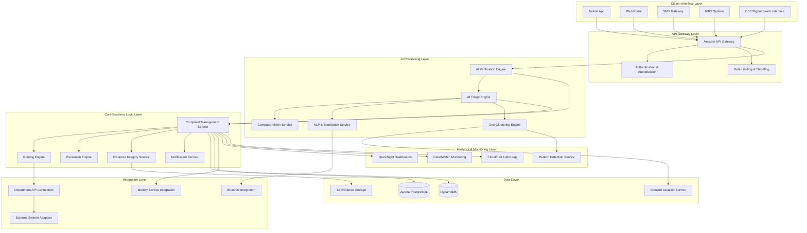
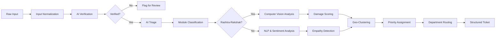
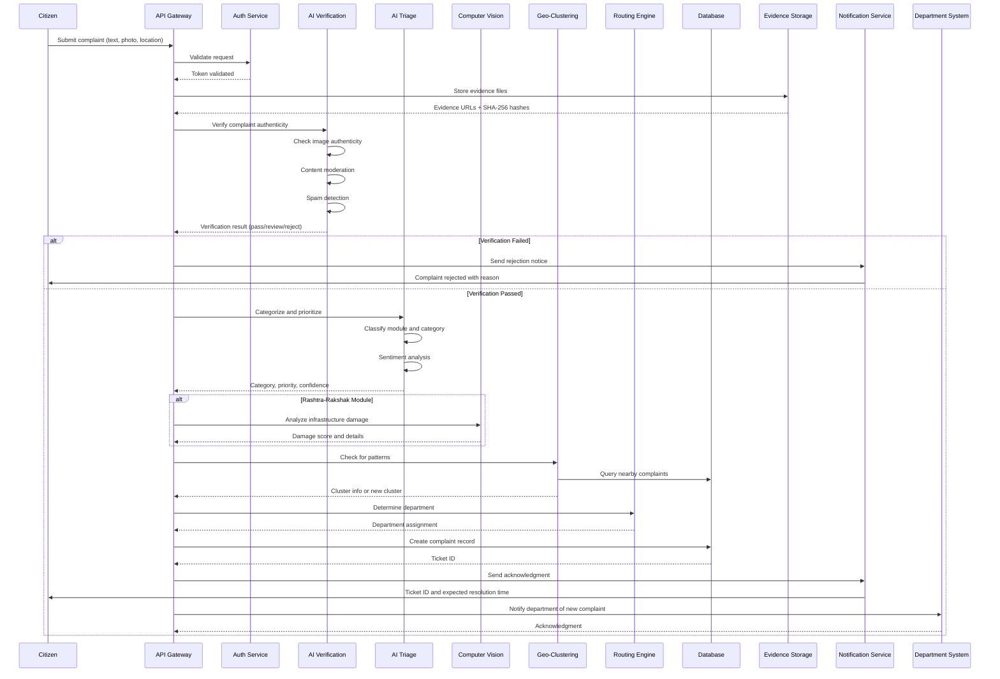
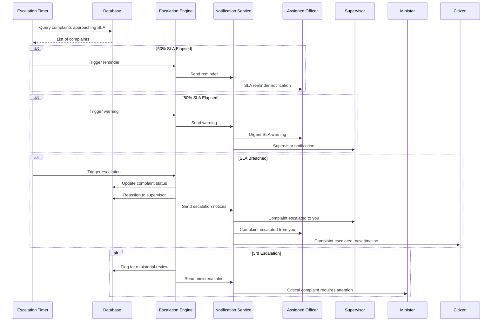
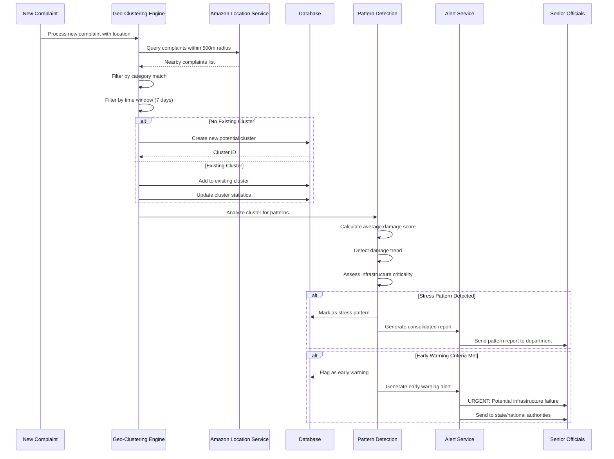
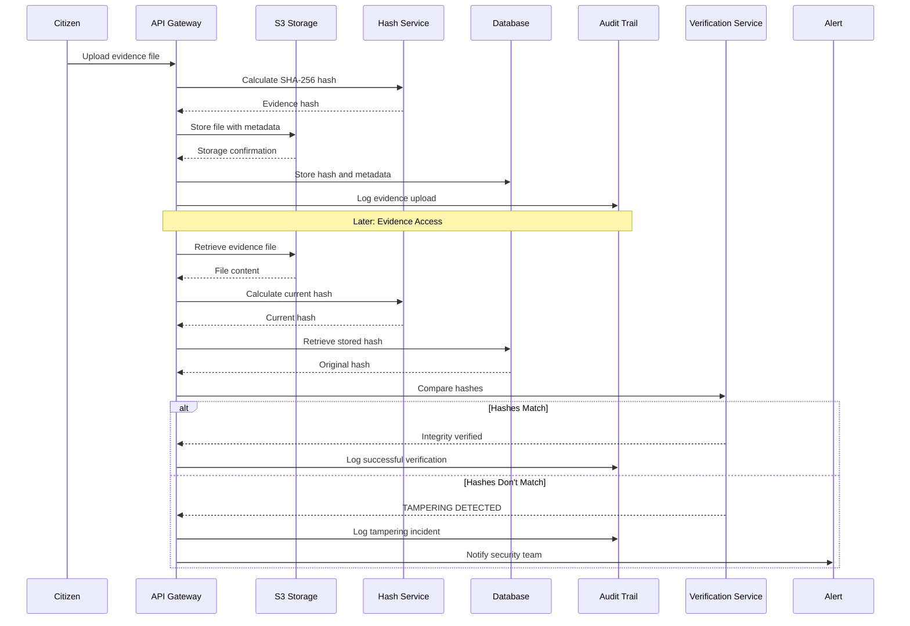
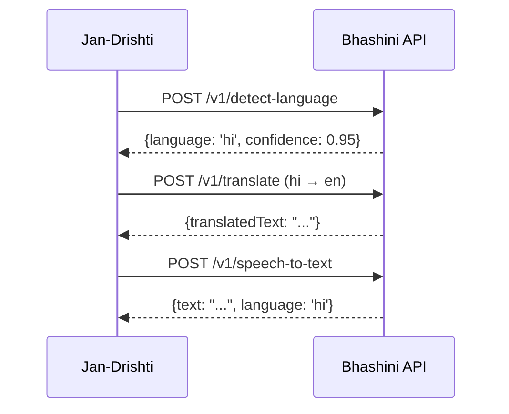
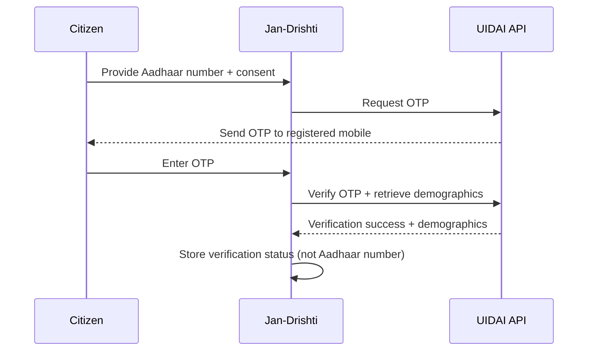
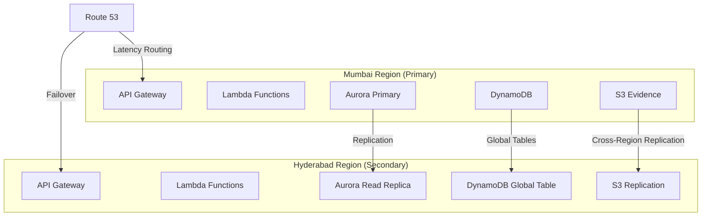
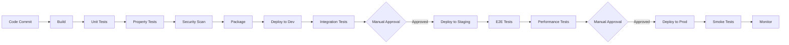

# Design Document: Jan-Drishti – AI-Native Civic Intelligence System for Bharat

## Overview

Jan-Drishti is an AI-First Governance Augmentation Engine that transforms unstructured citizen inputs into structured, verified, and actionable governance intelligence at national scale. The system serves as a unified intelligent front door for civic complaints across India, leveraging artificial intelligence throughout the complaint lifecycle.

### System Positioning

Jan-Drishti positions itself as:
- **AI Civic Intelligence Layer**: An intelligent intermediary between citizens and government
- **Governance Augmentation Engine**: Enhancing human decision-making with AI insights
- **Decision-Support System**: Providing data-driven recommendations while maintaining human oversight

### Core Architecture Philosophy

The system follows an AI-centric architecture where every citizen input flows through multiple AI processing stages before reaching human decision-makers:

```
Citizen Input → AI Layer → Decision Engine → Workflow Engine → Integration Layer → Government Systems
```

This design ensures:
- **Automated Verification**: AI validates authenticity before human review
- **Intelligent Triage**: AI categorizes and prioritizes before department assignment
- **Pattern Detection**: AI identifies systemic issues invisible to individual officers
- **Proactive Escalation**: AI monitors SLAs and escalates automatically
- **Evidence Integrity**: Cryptographic guarantees for legal admissibility
- **National Scalability**: Serverless architecture supporting millions of concurrent users

### Dual Module Architecture

**Module A – Rashtra-Rakshak (National Infrastructure Intelligence Layer)**
- Focus: Physical infrastructure monitoring and predictive maintenance
- Categories: Roads, bridges, water pipelines, drainage, streetlights, public buildings
- AI Capabilities: Computer vision damage scoring, geo-spatial clustering, early warning alerts
- Output: Infrastructure stress patterns, damage assessments, failure predictions

**Module B – Jan-Sahayak (Civil & Social Intelligence Layer)**
- Focus: Administrative grievances and social services
- Categories: Police complaints, legal aid, administrative issues, pension delays, women & child safety
- AI Capabilities: Empathetic multilingual processing, legal document drafting, sentiment analysis
- Output: Properly routed grievances, AI-assisted legal documents, priority escalations


## Logical Architecture

### High-Level System Components



### Component Responsibilities

**Citizen Interface Layer**
- Mobile App: Native iOS/Android apps with offline capability
- Web Portal: Responsive web application for desktop/mobile browsers
- SMS Gateway: Bidirectional SMS for feature phones
- IVRS System: Voice-based complaint submission and status checking
- CSC Interface: Assisted mode for digital literacy support

**API Gateway Layer**
- Request routing and load balancing
- Authentication using JWT tokens
- Authorization using IAM and RBAC
- Rate limiting to prevent abuse
- Request/response transformation

**AI Processing Layer**
- AI Verification Engine: Spam detection, evidence validation, authenticity checks
- AI Triage Engine: Categorization, prioritization, damage scoring
- Computer Vision Service: Infrastructure damage assessment using Amazon Rekognition
- NLP & Translation Service: Multilingual processing using Bhashini and Amazon Bedrock
- Geo-Clustering Engine: Spatial pattern detection using Amazon Location Service

**Core Business Logic Layer**
- Complaint Management Service: CRUD operations, state management, workflow orchestration
- Routing Engine: Department assignment based on rules and AI recommendations
- Escalation Engine: SLA monitoring and automatic escalation
- Evidence Integrity Service: SHA-256 hashing, tamper detection, audit trail
- Notification Service: Multi-channel notifications (SMS, email, push, in-app)

**Data Layer**
- Aurora PostgreSQL: Transactional data (complaints, users, departments, audit logs)
- DynamoDB: High-velocity data (real-time status, notifications, sessions)
- S3 Evidence Storage: Photos, videos, audio files with lifecycle policies
- Amazon Location Service: Geospatial indexing and clustering

**Integration Layer**
- Department API Connectors: RESTful APIs for department system integration
- Bhashini Integration: Government multilingual AI platform
- Identity Service Integration: Aadhaar/identity verification (with consent)
- External System Adapters: Webhook handlers and event processors

**Analytics & Monitoring Layer**
- QuickSight Dashboards: National, state, and department analytics
- CloudWatch Monitoring: Metrics, logs, alarms, and distributed tracing
- CloudTrail Audit Logs: Security and compliance audit trail
- Pattern Detection Service: Early warning system for infrastructure stress


## AI Processing Pipeline

### Pipeline Overview

Every complaint flows through a multi-stage AI pipeline that transforms unstructured input into structured, actionable intelligence:



### Stage 1: Input Normalization

**Purpose**: Convert diverse input formats into standardized internal representation

**Processing Steps**:
1. **Channel Detection**: Identify input source (app, web, SMS, IVRS, CSC)
2. **Media Extraction**: Extract text, images, audio, video, and metadata
3. **Language Detection**: Identify language using Amazon Comprehend or Bhashini
4. **Transcription**: Convert voice to text using Amazon Transcribe (supports 22 Indian languages)
5. **Translation**: Translate to English for AI processing while preserving original
6. **Location Extraction**: Parse GPS coordinates or address text
7. **Timestamp Recording**: Capture submission time with timezone

**Output**: Normalized complaint object with all media and metadata

### Stage 2: AI Verification

**Purpose**: Validate authenticity and filter spam before human review

**AI Models Used**:
- Amazon Rekognition for image authenticity
- Amazon Bedrock (Claude 3.5 Sonnet) for content moderation
- Custom spam detection model

**Verification Checks**:
1. **Image Authenticity**: Detect stock photos, manipulated images, screenshots
2. **Content Moderation**: Flag abusive, inappropriate, or threatening language
3. **Spam Detection**: Identify repetitive submissions, bot-generated content
4. **Evidence Quality**: Assess if photos are clear enough for analysis
5. **Duplicate Detection**: Check for identical submissions from same user within 24 hours
6. **Coherence Check**: Verify text and evidence match the claimed issue

**Decision Logic**:
- **High Confidence Pass (>90%)**: Proceed to triage automatically
- **Medium Confidence (70-90%)**: Proceed with flag for spot-check review
- **Low Confidence (<70%)**: Queue for manual verification
- **Spam/Abuse Detected**: Reject with explanation to citizen

**Output**: Verification score, flags, and decision (pass/review/reject)

### Stage 3: AI Triage and Categorization

**Purpose**: Classify complaint into appropriate module and category with priority

**AI Model**: Amazon Bedrock (Claude 3.5 Sonnet) with custom prompt engineering

**Classification Hierarchy**:
```
Level 1: Module Selection
├── Rashtra-Rakshak (Infrastructure)
│   ├── Roads
│   ├── Bridges
│   ├── Water Pipelines
│   ├── Drainage
│   ├── Streetlights
│   └── Public Buildings
└── Jan-Sahayak (Civil/Social)
    ├── Police Complaints
    ├── Legal Aid
    ├── Administrative Grievances
    ├── Pension Delays
    └── Women & Child Safety
```

**Priority Assignment Logic**:
- **Critical**: Immediate safety risk, infrastructure collapse, women/child safety
- **High**: Significant damage (score >70), urgent administrative issues, legal emergencies
- **Medium**: Moderate damage (score 40-70), routine administrative issues
- **Low**: Minor issues (score <40), informational complaints

**Confidence Scoring**:
- AI provides confidence score (0-100) for each classification
- Confidence <70% triggers human review
- Multiple possible categories ranked by confidence

**Output**: Module, category, subcategory, priority, confidence scores

### Stage 4: Computer Vision Analysis (Rashtra-Rakshak Only)

**Purpose**: Assess infrastructure damage severity from visual evidence

**AI Service**: Amazon Rekognition Custom Labels + Amazon Bedrock for reasoning

**Analysis Process**:
1. **Object Detection**: Identify infrastructure type (road, bridge, pipe, etc.)
2. **Damage Detection**: Detect cracks, potholes, corrosion, leaks, structural issues
3. **Measurement Estimation**: Estimate size/extent of damage from visual cues
4. **Context Analysis**: Consider surrounding environment and safety implications
5. **Damage Scoring**: Generate 0-100 score based on severity

**Damage Score Calibration**:
- **0-20**: Cosmetic issues, no functional impact
- **21-40**: Minor damage, routine maintenance needed
- **41-60**: Moderate damage, repair needed within weeks
- **61-80**: Significant damage, urgent repair needed
- **81-100**: Critical damage, immediate safety risk

**Quality Checks**:
- Verify photo shows claimed infrastructure type
- Check if damage is visible and assessable
- Flag if additional photos needed from specific angles
- Detect if photo is too dark, blurry, or obstructed

**Output**: Damage score, confidence level, detected issues, photo quality assessment

### Stage 5: NLP and Sentiment Analysis (Jan-Sahayak Focus)

**Purpose**: Understand citizen emotional state and urgency for empathetic response

**AI Service**: Amazon Bedrock (Claude 3.5 Sonnet) with sentiment analysis

**Analysis Dimensions**:
1. **Sentiment**: Positive, neutral, negative, highly distressed
2. **Urgency**: Low, medium, high, critical
3. **Emotion**: Frustration, fear, anger, desperation, hope
4. **Tone**: Formal, informal, aggressive, pleading
5. **Complexity**: Simple request vs. complex multi-issue complaint

**Special Handling**:
- **Women & Child Safety**: Automatic high priority, sensitive handling flag
- **Extreme Distress**: Immediate escalation to senior officers
- **Suicidal Ideation**: Alert mental health support resources
- **Threats of Violence**: Flag for security review

**Legal Aid Processing**:
- Extract key facts for legal document generation
- Identify relevant laws and precedents
- Assess complexity (routine vs. requires lawyer)

**Output**: Sentiment scores, urgency level, special handling flags, extracted facts

### Stage 6: Geo-Clustering and Pattern Detection

**Purpose**: Identify spatial patterns indicating systemic infrastructure issues

**AI Service**: Amazon Location Service + custom clustering algorithms

**Clustering Process**:
1. **Spatial Indexing**: Index complaint by GPS coordinates
2. **Proximity Search**: Find complaints within 100m radius
3. **Category Matching**: Group similar complaint types
4. **Temporal Analysis**: Consider complaints within 7-day window
5. **Cluster Formation**: Create cluster when 5+ related complaints found
6. **Trend Analysis**: Detect if damage scores are increasing over time

**Stress Pattern Detection**:
- **Emerging Pattern**: 5-10 complaints in cluster, monitoring
- **Confirmed Pattern**: 10-20 complaints, consolidated report generated
- **Critical Pattern**: 20+ complaints or escalating damage scores, early warning alert

**Early Warning Logic**:
```
IF cluster_size >= 10 AND
   average_damage_score > 60 AND
   damage_trend = "increasing" AND
   infrastructure_type IN ["bridge", "water_main", "major_road"]
THEN generate_early_warning_alert()
```

**Output**: Cluster ID, pattern type, severity, early warning flag, affected area

### Stage 7: Department Routing

**Purpose**: Assign complaint to appropriate government department

**Routing Engine**: Rule-based system with AI assistance for edge cases

**Routing Factors**:
1. **Category**: Primary determinant of department
2. **Location**: Jurisdiction (municipal, district, state, national)
3. **Severity**: High-priority complaints may route to senior officials
4. **Specialization**: Specific expertise required (e.g., structural engineering)
5. **Workload**: Balance load across departments when multiple options exist

**Routing Rules Example**:
```
IF category = "Roads" AND location.type = "Municipal"
THEN assign_to(Municipal_Public_Works_Department, location.municipality)

IF category = "Women_Safety" AND priority = "Critical"
THEN assign_to(Police_Department, location.district) AND
     notify(Women_Safety_Cell, location.state)
```

**Multi-Department Routing**:
- Primary department: Responsible for resolution
- Secondary departments: Notified for coordination
- Escalation chain: Defined hierarchy for SLA breaches

**AI Assistance**:
- For ambiguous cases, AI recommends department with confidence score
- Human administrator reviews recommendations <70% confidence
- System learns from administrator corrections

**Output**: Primary department, secondary departments, assigned officer, SLA deadline


## Data Flow

### Complaint Submission Flow



### Escalation Flow



### Geo-Clustering Flow



### Evidence Integrity Flow




## Components and Interfaces

### Core Services

#### Complaint Management Service

**Responsibilities**:
- CRUD operations for complaints
- State machine management (submitted → verified → triaged → assigned → in_progress → resolved → closed)
- Workflow orchestration using AWS Step Functions
- Business rule enforcement

**Key Interfaces**:
```typescript
interface ComplaintManagementService {
  // Complaint lifecycle
  createComplaint(input: ComplaintInput): Promise<Complaint>
  updateComplaintStatus(ticketId: string, status: ComplaintStatus, details: StatusUpdate): Promise<void>
  getComplaint(ticketId: string): Promise<Complaint>
  searchComplaints(criteria: SearchCriteria): Promise<ComplaintList>
  
  // Evidence management
  attachEvidence(ticketId: string, evidence: Evidence): Promise<void>
  verifyEvidenceIntegrity(ticketId: string, evidenceId: string): Promise<IntegrityResult>
  
  // Audit trail
  getAuditTrail(ticketId: string): Promise<AuditEntry[]>
  recordAction(ticketId: string, action: Action, actor: Actor): Promise<void>
}

interface ComplaintInput {
  channel: 'mobile_app' | 'web' | 'sms' | 'ivrs' | 'csc'
  citizenId: string
  description: string
  language: string
  location: GeoLocation
  evidence: Evidence[]
  metadata: Record<string, any>
}

interface Complaint {
  ticketId: string
  citizenId: string
  status: ComplaintStatus
  module: 'rashtra_rakshak' | 'jan_sahayak'
  category: string
  subcategory: string
  priority: 'critical' | 'high' | 'medium' | 'low'
  description: string
  originalLanguage: string
  location: GeoLocation
  evidence: Evidence[]
  aiAnalysis: AIAnalysis
  assignedDepartment: Department
  assignedOfficer: Officer
  slaDeadline: Date
  createdAt: Date
  updatedAt: Date
  resolvedAt?: Date
  clusterId?: string
}

type ComplaintStatus = 
  | 'submitted'
  | 'verifying'
  | 'verification_failed'
  | 'triaging'
  | 'assigned'
  | 'in_progress'
  | 'pending_info'
  | 'resolved'
  | 'closed'
  | 'appealed'
```

#### AI Verification Engine

**Responsibilities**:
- Image authenticity detection
- Content moderation
- Spam detection
- Evidence quality assessment
- Duplicate detection

**Key Interfaces**:
```typescript
interface AIVerificationEngine {
  verifyComplaint(complaint: ComplaintInput): Promise<VerificationResult>
  checkImageAuthenticity(image: Image): Promise<AuthenticityScore>
  moderateContent(text: string): Promise<ModerationResult>
  detectSpam(complaint: ComplaintInput, userHistory: ComplaintHistory): Promise<SpamScore>
  assessEvidenceQuality(evidence: Evidence): Promise<QualityAssessment>
}

interface VerificationResult {
  decision: 'pass' | 'review' | 'reject'
  confidence: number // 0-100
  flags: VerificationFlag[]
  reasons: string[]
  authenticityScore: number
  spamScore: number
  contentModerationResult: ModerationResult
}

interface VerificationFlag {
  type: 'spam' | 'abuse' | 'manipulation' | 'low_quality' | 'duplicate'
  severity: 'low' | 'medium' | 'high'
  description: string
}
```

#### AI Triage Engine

**Responsibilities**:
- Module classification (Rashtra-Rakshak vs Jan-Sahayak)
- Category and subcategory assignment
- Priority determination
- Sentiment analysis
- Confidence scoring

**Key Interfaces**:
```typescript
interface AITriageEngine {
  categorizeComplaint(complaint: Complaint): Promise<CategorizationResult>
  analyzeSentiment(text: string): Promise<SentimentAnalysis>
  determinePriority(complaint: Complaint, aiAnalysis: AIAnalysis): Promise<Priority>
}

interface CategorizationResult {
  module: 'rashtra_rakshak' | 'jan_sahayak'
  category: string
  subcategory: string
  confidence: number // 0-100
  alternativeCategories: Array<{category: string, confidence: number}>
  reasoning: string
}

interface SentimentAnalysis {
  sentiment: 'positive' | 'neutral' | 'negative' | 'highly_distressed'
  urgency: 'low' | 'medium' | 'high' | 'critical'
  emotions: Array<{emotion: string, intensity: number}>
  tone: string
  specialFlags: Array<'women_safety' | 'child_safety' | 'suicidal' | 'threat'>
}

type Priority = 'critical' | 'high' | 'medium' | 'low'
```

#### Computer Vision Service

**Responsibilities**:
- Infrastructure damage detection
- Damage severity scoring
- Object recognition
- Measurement estimation

**Key Interfaces**:
```typescript
interface ComputerVisionService {
  analyzeDamage(image: Image, infrastructureType: string): Promise<DamageAnalysis>
  detectInfrastructureType(image: Image): Promise<InfrastructureDetection>
  estimateDamageExtent(image: Image, damageType: string): Promise<ExtentEstimation>
}

interface DamageAnalysis {
  damageScore: number // 0-100
  confidence: number
  detectedIssues: DamageIssue[]
  infrastructureType: string
  severity: 'cosmetic' | 'minor' | 'moderate' | 'significant' | 'critical'
  recommendations: string[]
  photoQuality: 'excellent' | 'good' | 'fair' | 'poor'
  additionalPhotosNeeded: boolean
  suggestedAngles?: string[]
}

interface DamageIssue {
  type: string // 'crack', 'pothole', 'corrosion', 'leak', etc.
  location: BoundingBox
  estimatedSize: Measurement
  severity: number // 0-100
}
```

#### Geo-Clustering Engine

**Responsibilities**:
- Spatial indexing of complaints
- Proximity-based clustering
- Pattern detection
- Early warning generation

**Key Interfaces**:
```typescript
interface GeoClusteringEngine {
  processComplaint(complaint: Complaint): Promise<ClusterResult>
  findNearbyComplaints(location: GeoLocation, radius: number, category: string): Promise<Complaint[]>
  detectPatterns(clusterId: string): Promise<PatternAnalysis>
  generateEarlyWarning(clusterId: string): Promise<EarlyWarning | null>
}

interface ClusterResult {
  clusterId: string
  isNewCluster: boolean
  clusterSize: number
  clusterCenter: GeoLocation
  clusterRadius: number
  relatedComplaints: string[] // ticket IDs
  patternDetected: boolean
  patternType?: 'emerging' | 'confirmed' | 'critical'
}

interface PatternAnalysis {
  clusterId: string
  complaintCount: number
  averageDamageScore: number
  damageTrend: 'stable' | 'increasing' | 'decreasing'
  timeSpan: number // days
  affectedArea: number // square meters
  infrastructureType: string
  riskLevel: 'low' | 'medium' | 'high' | 'critical'
  earlyWarningTriggered: boolean
}

interface EarlyWarning {
  alertId: string
  clusterId: string
  severity: 'warning' | 'urgent' | 'critical'
  predictedFailureWindow: string // e.g., "7-14 days"
  affectedPopulation: number
  recommendedActions: string[]
  notificationsSent: string[] // official IDs
}
```

#### Routing Engine

**Responsibilities**:
- Department assignment based on rules
- Jurisdiction determination
- Workload balancing
- Multi-department coordination

**Key Interfaces**:
```typescript
interface RoutingEngine {
  routeComplaint(complaint: Complaint): Promise<RoutingDecision>
  findResponsibleDepartment(category: string, location: GeoLocation): Promise<Department>
  balanceWorkload(departments: Department[]): Promise<Department>
  handleRejection(ticketId: string, reason: string): Promise<RoutingDecision>
}

interface RoutingDecision {
  primaryDepartment: Department
  secondaryDepartments: Department[]
  assignedOfficer: Officer
  slaDeadline: Date
  escalationChain: Officer[]
  confidence: number
  reasoning: string
}

interface Department {
  departmentId: string
  name: string
  type: string
  jurisdiction: Jurisdiction
  contactInfo: ContactInfo
  currentWorkload: number
  averageResolutionTime: number
  slaCompliance: number
}
```

#### Escalation Engine

**Responsibilities**:
- SLA monitoring
- Automatic escalation
- Reminder notifications
- Escalation chain management

**Key Interfaces**:
```typescript
interface EscalationEngine {
  monitorSLAs(): Promise<void>
  escalateComplaint(ticketId: string, reason: EscalationReason): Promise<void>
  sendReminder(ticketId: string, recipient: Officer): Promise<void>
  getEscalationHistory(ticketId: string): Promise<EscalationEvent[]>
}

interface EscalationEvent {
  eventId: string
  ticketId: string
  timestamp: Date
  type: 'reminder' | 'warning' | 'escalation'
  fromOfficer: Officer
  toOfficer: Officer
  reason: EscalationReason
  slaPercentage: number
}

type EscalationReason = 
  | 'sla_50_percent'
  | 'sla_80_percent'
  | 'sla_breach'
  | 'no_response'
  | 'citizen_appeal'
  | 'manual_escalation'
```

#### Evidence Integrity Service

**Responsibilities**:
- SHA-256 hash generation
- Tamper detection
- Audit trail maintenance
- Secure storage coordination

**Key Interfaces**:
```typescript
interface EvidenceIntegrityService {
  storeEvidence(file: File, metadata: EvidenceMetadata): Promise<Evidence>
  verifyIntegrity(evidenceId: string): Promise<IntegrityResult>
  getAuditTrail(evidenceId: string): Promise<AuditEntry[]>
  detectTampering(evidenceId: string): Promise<TamperingReport | null>
}

interface Evidence {
  evidenceId: string
  ticketId: string
  type: 'photo' | 'video' | 'audio' | 'document'
  storageUrl: string
  hash: string // SHA-256
  size: number
  mimeType: string
  uploadedAt: Date
  uploadedBy: string
  metadata: EvidenceMetadata
}

interface IntegrityResult {
  evidenceId: string
  isIntact: boolean
  originalHash: string
  currentHash: string
  lastVerified: Date
  tamperingDetected: boolean
}
```

#### Notification Service

**Responsibilities**:
- Multi-channel notification delivery
- Template management
- Delivery tracking
- Retry logic

**Key Interfaces**:
```typescript
interface NotificationService {
  sendNotification(notification: Notification): Promise<DeliveryResult>
  sendBulkNotifications(notifications: Notification[]): Promise<DeliveryResult[]>
  getDeliveryStatus(notificationId: string): Promise<DeliveryStatus>
  retryFailedNotification(notificationId: string): Promise<DeliveryResult>
}

interface Notification {
  notificationId: string
  recipientId: string
  channel: 'sms' | 'email' | 'push' | 'in_app'
  template: string
  variables: Record<string, any>
  language: string
  priority: 'low' | 'normal' | 'high' | 'urgent'
  scheduledAt?: Date
}

interface DeliveryResult {
  notificationId: string
  status: 'sent' | 'delivered' | 'failed' | 'pending'
  sentAt: Date
  deliveredAt?: Date
  failureReason?: string
  retryCount: number
}
```


## Data Models

### Core Entities

#### Complaint Entity (Aurora PostgreSQL)

```sql
CREATE TABLE complaints (
  ticket_id VARCHAR(20) PRIMARY KEY,
  citizen_id VARCHAR(50) NOT NULL,
  status VARCHAR(20) NOT NULL,
  module VARCHAR(20) NOT NULL,
  category VARCHAR(50) NOT NULL,
  subcategory VARCHAR(50),
  priority VARCHAR(10) NOT NULL,
  description TEXT NOT NULL,
  original_language VARCHAR(10) NOT NULL,
  translated_description TEXT,
  location_lat DECIMAL(10, 8) NOT NULL,
  location_lng DECIMAL(11, 8) NOT NULL,
  location_address TEXT,
  location_accuracy DECIMAL(5, 2),
  assigned_department_id VARCHAR(50),
  assigned_officer_id VARCHAR(50),
  sla_deadline TIMESTAMP,
  created_at TIMESTAMP NOT NULL DEFAULT CURRENT_TIMESTAMP,
  updated_at TIMESTAMP NOT NULL DEFAULT CURRENT_TIMESTAMP,
  resolved_at TIMESTAMP,
  closed_at TIMESTAMP,
  cluster_id VARCHAR(50),
  verification_score DECIMAL(5, 2),
  spam_score DECIMAL(5, 2),
  damage_score DECIMAL(5, 2),
  sentiment_score DECIMAL(5, 2),
  urgency_level VARCHAR(10),
  escalation_count INTEGER DEFAULT 0,
  appeal_count INTEGER DEFAULT 0,
  
  INDEX idx_status (status),
  INDEX idx_category (category),
  INDEX idx_location (location_lat, location_lng),
  INDEX idx_assigned_officer (assigned_officer_id),
  INDEX idx_sla_deadline (sla_deadline),
  INDEX idx_cluster (cluster_id),
  INDEX idx_created_at (created_at)
);
```

#### Evidence Entity (Aurora PostgreSQL)

```sql
CREATE TABLE evidence (
  evidence_id VARCHAR(50) PRIMARY KEY,
  ticket_id VARCHAR(20) NOT NULL,
  evidence_type VARCHAR(20) NOT NULL,
  storage_url TEXT NOT NULL,
  hash_sha256 VARCHAR(64) NOT NULL,
  file_size BIGINT NOT NULL,
  mime_type VARCHAR(100) NOT NULL,
  uploaded_at TIMESTAMP NOT NULL DEFAULT CURRENT_TIMESTAMP,
  uploaded_by VARCHAR(50) NOT NULL,
  last_verified_at TIMESTAMP,
  integrity_status VARCHAR(20) DEFAULT 'verified',
  
  FOREIGN KEY (ticket_id) REFERENCES complaints(ticket_id),
  INDEX idx_ticket (ticket_id),
  INDEX idx_hash (hash_sha256)
);
```

#### Audit Trail Entity (Aurora PostgreSQL)

```sql
CREATE TABLE audit_trail (
  audit_id BIGSERIAL PRIMARY KEY,
  ticket_id VARCHAR(20) NOT NULL,
  timestamp TIMESTAMP NOT NULL DEFAULT CURRENT_TIMESTAMP,
  actor_id VARCHAR(50) NOT NULL,
  actor_type VARCHAR(20) NOT NULL, -- 'citizen', 'officer', 'system', 'ai'
  action VARCHAR(50) NOT NULL,
  old_value JSONB,
  new_value JSONB,
  ip_address INET,
  user_agent TEXT,
  
  FOREIGN KEY (ticket_id) REFERENCES complaints(ticket_id),
  INDEX idx_ticket (ticket_id),
  INDEX idx_timestamp (timestamp),
  INDEX idx_actor (actor_id)
);
```

#### Cluster Entity (Aurora PostgreSQL)

```sql
CREATE TABLE clusters (
  cluster_id VARCHAR(50) PRIMARY KEY,
  category VARCHAR(50) NOT NULL,
  center_lat DECIMAL(10, 8) NOT NULL,
  center_lng DECIMAL(11, 8) NOT NULL,
  radius_meters INTEGER NOT NULL,
  complaint_count INTEGER NOT NULL DEFAULT 0,
  average_damage_score DECIMAL(5, 2),
  damage_trend VARCHAR(20), -- 'stable', 'increasing', 'decreasing'
  pattern_type VARCHAR(20), -- 'emerging', 'confirmed', 'critical'
  early_warning_triggered BOOLEAN DEFAULT FALSE,
  created_at TIMESTAMP NOT NULL DEFAULT CURRENT_TIMESTAMP,
  updated_at TIMESTAMP NOT NULL DEFAULT CURRENT_TIMESTAMP,
  
  INDEX idx_location (center_lat, center_lng),
  INDEX idx_category (category),
  INDEX idx_pattern_type (pattern_type)
);
```

#### Department Entity (Aurora PostgreSQL)

```sql
CREATE TABLE departments (
  department_id VARCHAR(50) PRIMARY KEY,
  name VARCHAR(200) NOT NULL,
  department_type VARCHAR(50) NOT NULL,
  jurisdiction_type VARCHAR(20) NOT NULL, -- 'municipal', 'district', 'state', 'national'
  jurisdiction_code VARCHAR(20) NOT NULL,
  parent_department_id VARCHAR(50),
  contact_email VARCHAR(100),
  contact_phone VARCHAR(20),
  current_workload INTEGER DEFAULT 0,
  average_resolution_hours DECIMAL(10, 2),
  sla_compliance_percentage DECIMAL(5, 2),
  is_active BOOLEAN DEFAULT TRUE,
  
  FOREIGN KEY (parent_department_id) REFERENCES departments(department_id),
  INDEX idx_jurisdiction (jurisdiction_type, jurisdiction_code),
  INDEX idx_type (department_type)
);
```

#### Officer Entity (Aurora PostgreSQL)

```sql
CREATE TABLE officers (
  officer_id VARCHAR(50) PRIMARY KEY,
  name VARCHAR(200) NOT NULL,
  email VARCHAR(100) NOT NULL UNIQUE,
  phone VARCHAR(20),
  department_id VARCHAR(50) NOT NULL,
  role VARCHAR(50) NOT NULL,
  supervisor_id VARCHAR(50),
  assigned_complaint_count INTEGER DEFAULT 0,
  average_resolution_hours DECIMAL(10, 2),
  sla_compliance_percentage DECIMAL(5, 2),
  is_active BOOLEAN DEFAULT TRUE,
  created_at TIMESTAMP NOT NULL DEFAULT CURRENT_TIMESTAMP,
  
  FOREIGN KEY (department_id) REFERENCES departments(department_id),
  FOREIGN KEY (supervisor_id) REFERENCES officers(officer_id),
  INDEX idx_department (department_id),
  INDEX idx_supervisor (supervisor_id)
);
```

#### Citizen Entity (Aurora PostgreSQL)

```sql
CREATE TABLE citizens (
  citizen_id VARCHAR(50) PRIMARY KEY,
  phone VARCHAR(20),
  email VARCHAR(100),
  preferred_language VARCHAR(10) NOT NULL DEFAULT 'en',
  preferred_notification_channel VARCHAR(20) DEFAULT 'sms',
  aadhaar_verified BOOLEAN DEFAULT FALSE,
  total_complaints INTEGER DEFAULT 0,
  resolved_complaints INTEGER DEFAULT 0,
  average_satisfaction DECIMAL(3, 2),
  is_blocked BOOLEAN DEFAULT FALSE,
  created_at TIMESTAMP NOT NULL DEFAULT CURRENT_TIMESTAMP,
  
  INDEX idx_phone (phone),
  INDEX idx_email (email)
);
```

### DynamoDB Tables (High-Velocity Data)

#### Complaint Status Updates (DynamoDB)

```typescript
interface ComplaintStatusUpdate {
  ticketId: string // Partition Key
  timestamp: number // Sort Key (Unix timestamp)
  status: string
  updatedBy: string
  details: Record<string, any>
  ttl: number // Auto-expire after 90 days
}
```

#### Real-Time Notifications (DynamoDB)

```typescript
interface NotificationRecord {
  notificationId: string // Partition Key
  recipientId: string // GSI Partition Key
  timestamp: number // GSI Sort Key
  channel: string
  status: string
  content: Record<string, any>
  deliveredAt?: number
  ttl: number // Auto-expire after 30 days
}
```

#### Session Management (DynamoDB)

```typescript
interface UserSession {
  sessionId: string // Partition Key
  userId: string // GSI Partition Key
  userType: 'citizen' | 'officer' | 'admin'
  createdAt: number
  expiresAt: number
  lastActivity: number
  metadata: Record<string, any>
  ttl: number // Auto-expire after expiration
}
```

### S3 Storage Structure

```
jan-drishti-evidence-{region}/
├── photos/
│   ├── {year}/
│   │   ├── {month}/
│   │   │   ├── {ticket_id}/
│   │   │   │   ├── {evidence_id}.jpg
│   │   │   │   └── {evidence_id}_thumbnail.jpg
├── videos/
│   ├── {year}/
│   │   ├── {month}/
│   │   │   ├── {ticket_id}/
│   │   │   │   └── {evidence_id}.mp4
├── audio/
│   ├── {year}/
│   │   ├── {month}/
│   │   │   ├── {ticket_id}/
│   │   │   │   └── {evidence_id}.mp3
└── documents/
    ├── {year}/
    │   ├── {month}/
    │   │   ├── {ticket_id}/
    │   │   │   └── {evidence_id}.pdf
```

**S3 Lifecycle Policies**:
- Standard storage: 0-90 days
- Infrequent Access: 91-365 days
- Glacier: 366+ days
- Retention: 7 years for legal compliance


## Correctness Properties

### What are Correctness Properties?

A property is a characteristic or behavior that should hold true across all valid executions of a system—essentially, a formal statement about what the system should do. Properties serve as the bridge between human-readable specifications and machine-verifiable correctness guarantees.

In Jan-Drishti, correctness properties ensure that the AI-driven civic intelligence system behaves consistently and correctly across millions of citizen interactions, maintaining trust in government services at national scale.

### Core System Properties

#### Property 1: Multi-Channel Submission Completeness

*For any* valid complaint submitted through any supported channel (mobile app, web, SMS, IVRS, CSC), the system should accept the submission and generate a unique ticket ID that is returned to the citizen.

**Validates: Requirements 1.1, 1.2, 1.3**

#### Property 2: Location Data Capture

*For any* complaint that includes location data, the system should capture and store GPS coordinates along with accuracy metadata.

**Validates: Requirements 1.7**

#### Property 3: Submission Acknowledgment Timeliness

*For any* successfully submitted complaint, the system should send an acknowledgment containing the ticket ID to the citizen within 30 seconds.

**Validates: Requirements 1.8**

#### Property 4: Multilingual Processing

*For any* complaint submitted in any of the 22 supported Indian languages, the system should process it correctly, preserving the original language while enabling translation for AI processing.

**Validates: Requirements 1.6, 7.2**

### AI Verification Properties

#### Property 5: Verification Analysis Completeness

*For any* complaint with photo evidence, the AI verification engine should analyze the image for authenticity markers and produce a verification result with confidence score.

**Validates: Requirements 2.1**

#### Property 6: Manipulation Detection

*For any* photo evidence showing signs of manipulation or stock imagery, the AI verification engine should flag the complaint for manual review.

**Validates: Requirements 2.2**

#### Property 7: Content Moderation

*For any* complaint containing abusive or inappropriate language, the AI verification engine should flag it and apply content moderation.

**Validates: Requirements 2.3**

#### Property 8: Duplicate Spam Detection

*For any* user submitting multiple identical complaints within 24 hours, the system should detect and flag them as potential spam.

**Validates: Requirements 2.4**

#### Property 9: Verification State Transition

*For any* complaint that passes all verification checks, the system should mark it as verified and proceed to triage; for any complaint that fails verification, the system should notify the citizen with specific reasons.

**Validates: Requirements 2.6, 2.7**

### AI Triage Properties

#### Property 10: Module Classification Completeness

*For any* verified complaint, the AI triage engine should classify it into exactly one module (Rashtra-Rakshak or Jan-Sahayak) with an appropriate subcategory.

**Validates: Requirements 3.1, 3.2, 3.3**

#### Property 11: Damage Score Range Validity

*For any* infrastructure complaint with photo evidence, the AI triage engine should generate a damage score that falls within the valid range of 0-100 inclusive.

**Validates: Requirements 3.4, 6.5**

#### Property 12: Safety Priority Assignment

*For any* complaint indicating immediate safety risk, the AI triage engine should assign priority level as "Critical"; for any complaint involving women or child safety, the system should assign priority level as "High" and flag for sensitive handling.

**Validates: Requirements 3.5, 3.6**

#### Property 13: Low Confidence Human Review

*For any* categorization with confidence below 70%, the system should route the complaint to human review for final classification.

**Validates: Requirements 3.8**

### Routing Properties

#### Property 14: Department Assignment Completeness

*For any* categorized complaint, the routing engine should identify and assign at least one responsible department based on complaint type and location.

**Validates: Requirements 4.1**

#### Property 15: Department Notification Timeliness

*For any* complaint with completed department assignment, the system should notify the assigned department within 60 seconds.

**Validates: Requirements 4.4**

#### Property 16: Rejection Re-routing

*For any* complaint rejected by a department as outside their jurisdiction, the routing engine should automatically reassign it to a different department.

**Validates: Requirements 4.5**

### Geo-Clustering Properties

#### Property 17: Proximity Check Execution

*For any* new complaint with location data, the geo-clustering engine should check for existing complaints within 100 meters with similar categories.

**Validates: Requirements 5.1**

#### Property 18: Duplicate Linking

*For any* complaint detected as a duplicate, the system should link it to the original complaint and notify the citizen of the existing ticket.

**Validates: Requirements 5.2**

#### Property 19: Cluster Formation Threshold

*For any* geographic area where 5 or more complaints of the same category occur within a 500-meter radius within 7 days, the geo-clustering engine should create a stress pattern cluster.

**Validates: Requirements 5.3**

#### Property 20: Early Warning Generation

*For any* cluster where complaints show escalating damage scores over time, the system should generate an early warning alert.

**Validates: Requirements 5.5**

#### Property 21: Cluster Resolution Propagation

*For any* complaint that is resolved, the system should check if it resolves other linked complaints in the same cluster.

**Validates: Requirements 5.7**

### Computer Vision Properties

#### Property 22: Infrastructure Analysis Execution

*For any* Rashtra-Rakshak complaint that includes photo evidence, the system should use computer vision to analyze infrastructure condition and generate a damage assessment.

**Validates: Requirements 6.1**

#### Property 23: High Damage Score Escalation

*For any* complaint where the damage score exceeds 80, the system should automatically escalate to senior engineering staff.

**Validates: Requirements 6.6**

#### Property 24: Insufficient Quality Handling

*For any* photo evidence where quality is insufficient for analysis, the system should request additional photos from specific angles.

**Validates: Requirements 6.7, 2.5**

### Multilingual AI Properties

#### Property 25: Voice Transcription

*For any* voice complaint submitted, the system should use transcription services to convert speech to text in the detected language.

**Validates: Requirements 7.1**

#### Property 26: Response Language Matching

*For any* response generated for a citizen, the system should translate the message into the citizen's preferred language.

**Validates: Requirements 7.4**

#### Property 27: Low Confidence Language Confirmation

*For any* language detection with confidence below 80%, the system should prompt the citizen to confirm their language preference.

**Validates: Requirements 7.6**

### SLA and Escalation Properties

#### Property 28: SLA Deadline Assignment

*For any* complaint assigned to a department, the system should set an SLA deadline based on complaint priority and category.

**Validates: Requirements 8.1**

#### Property 29: Escalation Trigger Thresholds

*For any* complaint, when 50% of SLA time elapses without status update, the system should send a reminder; when 80% elapses without resolution, the system should notify the supervisor; when the deadline is breached, the system should escalate to the next authority level.

**Validates: Requirements 8.2, 8.3, 8.4**

#### Property 30: Multiple Escalation Ministerial Flag

*For any* complaint escalated 3 times without resolution, the system should flag it for ministerial review.

**Validates: Requirements 8.5**

#### Property 31: Escalation Citizen Notification

*For any* escalation that occurs, the system should notify the citizen of the escalation and provide a new expected resolution date.

**Validates: Requirements 8.7**

### Evidence Integrity Properties

#### Property 32: Evidence Hash Round-Trip

*For any* evidence file uploaded, the system should generate a SHA-256 hash and store it; when the evidence is later accessed, the current hash should match the stored hash, confirming integrity.

**Validates: Requirements 9.1, 9.2**

#### Property 33: Tampering Detection and Alert

*For any* evidence where tampering is detected (hash mismatch), the system should flag the complaint and notify security administrators.

**Validates: Requirements 9.3**

#### Property 34: Audit Trail Completeness

*For any* action taken on a complaint, the system should record it in the audit trail with timestamp, user ID, and action details; when queried, the audit trail should provide a complete chronological history.

**Validates: Requirements 9.4, 9.5**

#### Property 35: Closed Complaint Archival

*For any* complaint that is closed, the system should archive the audit trail for the retention period defined by policy.

**Validates: Requirements 9.8**

### Department Dashboard Properties

#### Property 36: Officer Dashboard Sorting

*For any* department officer who logs in, the system should display all complaints assigned to them sorted by priority and SLA urgency.

**Validates: Requirements 10.1**

#### Property 37: Complaint View Completeness

*For any* complaint viewed by an officer, the system should display all evidence, AI analysis, citizen details, and history.

**Validates: Requirements 10.2**

#### Property 38: Status Update Audit and Notification

*For any* complaint status update by an officer, the system should record the update in the audit trail and notify the citizen.

**Validates: Requirements 10.3**

#### Property 39: Resolution Requirements

*For any* complaint marked as resolved by an officer, the system should request resolution details and supporting evidence.

**Validates: Requirements 10.5**

#### Property 40: Resolution Survey Trigger

*For any* complaint that is resolved, the system should send a satisfaction survey to the citizen.

**Validates: Requirements 10.6**

#### Property 41: Reassignment Justification

*For any* complaint reassignment by an officer, the system should require mandatory justification.

**Validates: Requirements 10.7**

### Citizen Tracking Properties

#### Property 42: Ticket Status Display

*For any* citizen who logs in with their ticket ID, the system should display current status, assigned department, and expected resolution date.

**Validates: Requirements 11.1**

#### Property 43: Status Change Notification

*For any* complaint status change, the system should send a notification via the citizen's preferred channel.

**Validates: Requirements 11.2**

#### Property 44: Complaint History Completeness

*For any* citizen viewing their complaint history, the system should show all past complaints with outcomes.

**Validates: Requirements 11.6**

#### Property 45: Cluster Membership Notification

*For any* complaint that is part of a cluster, the system should inform the citizen that their issue is being addressed as part of a larger pattern.

**Validates: Requirements 11.7**

### Legal Aid Properties

#### Property 46: Legal Document Generation Format

*For any* legal document generated by AI from citizen-provided case details, the document should be in proper legal format with appropriate terminology and relevant law citations.

**Validates: Requirements 12.2, 12.3**

#### Property 47: AI-Generated Disclaimer

*For any* legal document draft generated by AI, the system should clearly mark it as "AI-Generated - Requires Legal Review".

**Validates: Requirements 12.4**

#### Property 48: Complex Matter Lawyer Recommendation

*For any* legal document involving complex matters, the system should recommend consulting a qualified lawyer.

**Validates: Requirements 12.5**

#### Property 49: Legal Term Explanation

*For any* citizen request for explanation of legal terms, the AI should provide plain-language explanations.

**Validates: Requirements 12.6**

### Analytics Properties

#### Property 50: Early Warning Authority Notification

*For any* early warning alert generated, the system should notify relevant authorities at state and national levels.

**Validates: Requirements 13.4**

#### Property 51: Correlation Detection

*For any* analysis of systemic issues, the system should use AI to detect correlations between complaint types and external factors.

**Validates: Requirements 13.6**

#### Property 52: Anomaly Alert Generation

*For any* anomaly detected in complaint patterns, the system should alert administrators of potential data quality issues or emerging crises.

**Validates: Requirements 13.8**

### Security and Access Control Properties

#### Property 53: Authentication Requirement

*For any* user attempting to access the system, the system should require authentication using secure credentials.

**Validates: Requirements 14.1**

#### Property 54: RBAC Enforcement

*For any* authenticated user, the system should enforce role-based access control based on their assigned role.

**Validates: Requirements 14.2**

#### Property 55: Unauthorized Action Denial and Logging

*For any* user attempting an unauthorized action, the system should deny access and log the attempt.

**Validates: Requirements 14.3**

#### Property 56: Sensitive Data Access Logging

*For any* access to sensitive data, the system should log the access with user ID, timestamp, and purpose.

**Validates: Requirements 14.4**

#### Property 57: Sensitive Complaint Access Restriction

*For any* complaint involving women or child safety, the system should restrict access to authorized personnel only.

**Validates: Requirements 14.5**

#### Property 58: Security Event Logging

*For any* security event that occurs, the system should log it to AWS CloudTrail for audit purposes.

**Validates: Requirements 14.8**

#### Property 59: Immediate Permission Update

*For any* user whose role changes, the system should update their permissions immediately without requiring re-login.

**Validates: Requirements 14.9**

### Integration Properties

#### Property 60: Consent-Based Identity Query

*For any* query to identity systems for citizen data, the system should require and verify citizen consent before making the query.

**Validates: Requirements 15.2**

#### Property 61: API Authentication Requirement

*For any* API request from department systems for complaint data, the system should require authentication.

**Validates: Requirements 15.3**

#### Property 62: Integration Error Retry

*For any* integration error that occurs, the system should log the error and retry with exponential backoff.

**Validates: Requirements 15.5**

#### Property 63: Rate Limit Throttling

*For any* API where rate limits are approached, the system should implement throttling and queue requests.

**Validates: Requirements 15.7**

### Privacy Properties

#### Property 64: Data Collection Consent

*For any* personal data collection, the system should obtain explicit consent from citizens.

**Validates: Requirements 18.2**

#### Property 65: Data Deletion Processing

*For any* citizen request for data deletion, the system should delete their data within 30 days except where legal retention is required.

**Validates: Requirements 18.3**

#### Property 66: Data Export Fulfillment

*For any* citizen request for data export, the system should provide their data in machine-readable format within 7 days.

**Validates: Requirements 18.4**

#### Property 67: Sensitive Category Enhanced Protection

*For any* complaint in sensitive categories (women & child safety), the system should apply additional privacy protections.

**Validates: Requirements 18.5**

#### Property 68: Data Minimization

*For any* data shared with departments, the system should share only the minimum necessary information.

**Validates: Requirements 18.6**

### Observability Properties

#### Property 69: Metrics Emission

*For any* system component in operation, the component should emit metrics for latency, throughput, and error rates.

**Validates: Requirements 19.1**

#### Property 70: Error Logging Detail

*For any* error that occurs, the system should log detailed error information including stack traces and context.

**Validates: Requirements 19.2**

#### Property 71: AI Decision Logging

*For any* decision made by AI models, the system should log confidence scores and reasoning for audit purposes.

**Validates: Requirements 19.3**


## Error Handling

### Error Handling Philosophy

Jan-Drishti follows a defense-in-depth approach to error handling, ensuring that failures at any layer are gracefully handled without compromising citizen experience or data integrity. The system distinguishes between:

1. **Recoverable Errors**: Automatically retried with exponential backoff
2. **User Errors**: Clear feedback provided to citizens/officers
3. **System Errors**: Logged, alerted, and escalated to operations teams
4. **Critical Errors**: Immediate escalation with fallback to manual processes

### Error Categories and Handling Strategies

#### Input Validation Errors

**Scenario**: Invalid or incomplete complaint data submitted by citizen

**Handling**:
- Validate input at API gateway before processing
- Return HTTP 400 with specific field-level error messages
- Provide clear guidance on how to correct the input
- Support partial saves for complex forms (draft mode)
- Log validation failures for pattern analysis

**Example**:
```json
{
  "error": "VALIDATION_ERROR",
  "message": "Complaint submission failed validation",
  "fields": {
    "location": "GPS coordinates required or address must be provided",
    "description": "Description must be at least 20 characters"
  },
  "code": "VAL_001"
}
```

#### AI Processing Errors

**Scenario**: AI verification, triage, or computer vision analysis fails

**Handling**:
- Retry with exponential backoff (3 attempts)
- If all retries fail, route to human review queue
- Notify citizen of delay with estimated manual review time
- Log AI failures for model improvement
- Maintain SLA by adjusting deadlines for manual review

**Fallback Chain**:
1. Primary AI model (Amazon Bedrock Claude 3.5 Sonnet)
2. Retry with adjusted parameters
3. Fallback to rule-based classification
4. Human review queue

#### External Integration Errors

**Scenario**: Bhashini translation API, department system, or identity service unavailable

**Handling**:
- Implement circuit breaker pattern (open after 5 consecutive failures)
- Queue requests for retry when service recovers
- Provide degraded functionality where possible
- Notify operations team if outage exceeds 5 minutes
- Display service status to users

**Circuit Breaker States**:
- **Closed**: Normal operation, requests flow through
- **Open**: Service unavailable, requests fail fast
- **Half-Open**: Testing recovery, limited requests allowed

#### Evidence Storage Errors

**Scenario**: S3 upload fails or evidence becomes inaccessible

**Handling**:
- Implement resumable uploads for large files
- Retry failed uploads automatically
- Store evidence metadata even if upload fails
- Allow citizens to re-upload evidence
- Maintain evidence integrity through checksums

**Recovery Process**:
1. Detect upload failure
2. Preserve partial upload state
3. Notify citizen of failure
4. Provide resume upload option
5. Verify integrity after successful upload

#### Database Errors

**Scenario**: Aurora or DynamoDB connection failure or timeout

**Handling**:
- Automatic failover to read replicas for queries
- Retry transactional writes with exponential backoff
- Use DynamoDB for critical path operations (high availability)
- Implement eventual consistency for non-critical data
- Alert DBA team for persistent failures

**Transaction Handling**:
- Use database transactions for state changes
- Implement idempotency keys to prevent duplicate operations
- Rollback on failure with compensation logic
- Log all transaction failures for audit

#### SLA Breach Errors

**Scenario**: Complaint not resolved within SLA deadline

**Handling**:
- Automatic escalation to next authority level
- Notify citizen of escalation and new timeline
- Flag for management review
- Analyze root cause (workload, complexity, department capacity)
- Adjust future SLA estimates based on patterns

#### Geo-Clustering Errors

**Scenario**: Location service unavailable or clustering algorithm fails

**Handling**:
- Store complaints without clustering temporarily
- Run batch clustering when service recovers
- Use cached cluster data for pattern detection
- Degrade to simple proximity search if clustering fails
- Alert if early warning system is impacted

#### Notification Delivery Errors

**Scenario**: SMS, email, or push notification fails to deliver

**Handling**:
- Retry delivery up to 3 times over 24 hours
- Try alternative channels if primary fails
- Mark notification as failed after all retries
- Store failed notifications for manual follow-up
- Provide in-app notification as fallback

**Channel Fallback Order**:
1. Preferred channel (SMS/email/push)
2. Alternative channel (if configured)
3. In-app notification (always available)
4. Manual follow-up queue

### Error Monitoring and Alerting

**Metrics Tracked**:
- Error rate by type and component
- Mean time to recovery (MTTR)
- Error impact on SLA compliance
- AI model failure rates
- Integration service availability

**Alert Thresholds**:
- Error rate > 1% for 5 minutes: Warning
- Error rate > 5% for 2 minutes: Critical
- AI processing failure > 10%: Critical
- External service down > 5 minutes: Warning
- Database connection failure: Critical (immediate)

**Alert Routing**:
- P1 (Critical): PagerDuty to on-call engineer + Slack
- P2 (Warning): Slack channel + email
- P3 (Info): Email digest + dashboard

### Error Recovery Procedures

**Automated Recovery**:
- Service restart for memory leaks or hung processes
- Cache invalidation for stale data issues
- Connection pool reset for database issues
- Circuit breaker reset after cooldown period

**Manual Recovery**:
- Human review queue processing
- Failed notification manual delivery
- Data consistency checks and repairs
- Cluster reprocessing for missed patterns


## Testing Strategy

### Testing Philosophy

Jan-Drishti employs a comprehensive testing strategy that combines traditional unit testing with property-based testing to ensure correctness at national scale. Given the AI-native architecture, testing focuses on:

1. **Deterministic Behavior**: Core business logic and data integrity
2. **AI Model Behavior**: Verification, triage, and computer vision accuracy
3. **Integration Reliability**: External service interactions
4. **Performance at Scale**: Load testing for millions of users
5. **Security Compliance**: Access control and data protection

### Dual Testing Approach

**Unit Tests**: Verify specific examples, edge cases, and error conditions
- Focus on concrete scenarios and boundary conditions
- Test integration points between components
- Validate error handling paths
- Ensure data model constraints

**Property-Based Tests**: Verify universal properties across all inputs
- Test with randomly generated complaint data
- Validate invariants hold for all valid inputs
- Ensure round-trip properties (serialization, hashing, translation)
- Verify metamorphic properties (clustering, routing)

Together, unit tests catch concrete bugs while property tests verify general correctness across the input space.

### Property-Based Testing Configuration

**Testing Library**: Use fast-check (JavaScript/TypeScript) or Hypothesis (Python) depending on implementation language

**Test Configuration**:
- Minimum 100 iterations per property test (due to randomization)
- Seed-based reproducibility for failed test cases
- Shrinking to find minimal failing examples
- Timeout of 30 seconds per property test

**Tagging Convention**:
Each property test must include a comment tag referencing the design document property:
```typescript
// Feature: jan-drishti-civic-intelligence, Property 1: Multi-Channel Submission Completeness
```

### Test Coverage by Component

#### Complaint Management Service

**Unit Tests**:
- Complaint creation with valid/invalid data
- State machine transitions (submitted → verified → assigned → resolved)
- Edge cases: missing fields, oversized descriptions, invalid locations
- Concurrent updates to same complaint
- Audit trail entry creation

**Property Tests**:
- Property 1: Multi-channel submission generates unique ticket IDs
- Property 2: Location data capture for all complaints with GPS
- Property 34: Audit trail completeness for all actions
- Property 35: Closed complaint archival

#### AI Verification Engine

**Unit Tests**:
- Specific examples of manipulated images
- Known spam patterns
- Abusive language samples
- Edge cases: empty images, corrupted files, unsupported formats

**Property Tests**:
- Property 5: Verification analysis for all photo evidence
- Property 6: Manipulation detection flags suspicious images
- Property 7: Content moderation flags inappropriate language
- Property 8: Duplicate spam detection within 24 hours
- Property 9: Verification state transitions

**AI Model Testing**:
- Accuracy benchmarks on labeled test dataset
- False positive/negative rates
- Confidence calibration (confidence matches actual accuracy)
- Adversarial testing with edge cases

#### AI Triage Engine

**Unit Tests**:
- Specific complaint examples for each category
- Priority assignment for known scenarios
- Confidence threshold edge cases
- Sentiment analysis examples

**Property Tests**:
- Property 10: Module classification completeness
- Property 11: Damage score range validity (0-100)
- Property 12: Safety priority assignment
- Property 13: Low confidence human review routing

**AI Model Testing**:
- Category classification accuracy > 90%
- Priority assignment accuracy > 85%
- Sentiment analysis correlation with human labels
- Multilingual performance parity

#### Computer Vision Service

**Unit Tests**:
- Specific infrastructure damage examples
- Known damage types (cracks, potholes, corrosion)
- Edge cases: night photos, obstructed views, weather conditions

**Property Tests**:
- Property 22: Infrastructure analysis execution for all Rashtra-Rakshak complaints
- Property 11: Damage score range validity
- Property 23: High damage score escalation (>80)
- Property 24: Insufficient quality handling

**AI Model Testing**:
- Damage detection accuracy on labeled dataset
- Damage score correlation with expert assessments
- Robustness to lighting and angle variations
- Performance across infrastructure types

#### Geo-Clustering Engine

**Unit Tests**:
- Specific cluster formation scenarios
- Edge cases: complaints at boundaries, overlapping clusters
- Cluster merging and splitting logic

**Property Tests**:
- Property 17: Proximity check execution for all complaints
- Property 18: Duplicate linking
- Property 19: Cluster formation threshold (5+ complaints)
- Property 20: Early warning generation for escalating damage
- Property 21: Cluster resolution propagation

**Algorithm Testing**:
- Clustering accuracy on synthetic datasets
- Performance with varying complaint densities
- Temporal pattern detection accuracy

#### Routing Engine

**Unit Tests**:
- Specific routing scenarios for each category
- Multi-department routing examples
- Cross-jurisdictional cases
- Rejection and re-routing flows

**Property Tests**:
- Property 14: Department assignment completeness
- Property 15: Department notification timeliness (<60s)
- Property 16: Rejection re-routing

**Rule Engine Testing**:
- Coverage of all routing rules
- Conflict resolution when multiple rules match
- Default routing when no rules match

#### Escalation Engine

**Unit Tests**:
- Specific SLA breach scenarios
- Escalation chain traversal
- Edge cases: no supervisor defined, circular escalation

**Property Tests**:
- Property 28: SLA deadline assignment
- Property 29: Escalation trigger thresholds (50%, 80%, 100%)
- Property 30: Multiple escalation ministerial flag
- Property 31: Escalation citizen notification

**Timing Tests**:
- SLA calculation accuracy
- Escalation trigger timing precision
- Reminder delivery timing

#### Evidence Integrity Service

**Unit Tests**:
- Specific tampering scenarios
- Hash collision handling
- Edge cases: zero-byte files, maximum file size

**Property Tests**:
- Property 32: Evidence hash round-trip (upload → retrieve → verify)
- Property 33: Tampering detection and alert

**Cryptographic Testing**:
- SHA-256 implementation correctness
- Hash uniqueness for different files
- Performance with large files

#### Notification Service

**Unit Tests**:
- Specific notification templates
- Channel-specific formatting
- Delivery failure scenarios
- Edge cases: invalid phone numbers, bounced emails

**Property Tests**:
- Property 3: Submission acknowledgment timeliness (<30s)
- Property 43: Status change notification
- Property 38: Status update notification

**Integration Testing**:
- SMS gateway integration
- Email service integration
- Push notification service integration
- Fallback channel switching

### Integration Testing

**API Integration Tests**:
- End-to-end complaint submission flows
- Department system webhook callbacks
- Bhashini translation API integration
- Identity service integration
- Amazon Bedrock AI model integration
- Amazon Rekognition computer vision integration

**Database Integration Tests**:
- Aurora PostgreSQL connection pooling
- DynamoDB eventual consistency handling
- S3 evidence storage and retrieval
- Cross-region replication verification

**Security Integration Tests**:
- Authentication and authorization flows
- RBAC enforcement across all endpoints
- Audit logging completeness
- Encryption at rest and in transit

### Performance Testing

**Load Testing**:
- 10,000 complaint submissions per second
- 1 million concurrent users
- Database query performance under load
- AI model inference latency

**Stress Testing**:
- 10x normal load spike handling
- Auto-scaling behavior verification
- Resource exhaustion scenarios
- Cascading failure prevention

**Endurance Testing**:
- 24-hour sustained load
- Memory leak detection
- Connection pool exhaustion
- Gradual performance degradation

### Security Testing

**Penetration Testing**:
- SQL injection attempts
- Cross-site scripting (XSS)
- Authentication bypass attempts
- Authorization escalation attempts
- API abuse and rate limit testing

**Compliance Testing**:
- Data encryption verification
- Audit log completeness
- Access control enforcement
- Privacy policy compliance (DPDP Act 2023)

### Chaos Engineering

**Failure Injection**:
- Random service failures
- Network partition simulation
- Database failover testing
- AI model unavailability
- External service outages

**Recovery Validation**:
- Automatic failover verification
- Data consistency after recovery
- SLA impact measurement
- Alert and escalation effectiveness

### Test Environments

**Development**: Individual developer testing, unit tests, fast feedback
**Integration**: Component integration testing, external service mocks
**Staging**: Full system testing, production-like data, performance testing
**Production**: Canary deployments, A/B testing, real user monitoring

### Continuous Testing

**CI/CD Pipeline**:
1. Code commit triggers automated tests
2. Unit tests run in parallel (<5 minutes)
3. Property tests run with 100 iterations (<10 minutes)
4. Integration tests run against test environment (<15 minutes)
5. Security scans (SAST, dependency checks)
6. Performance regression tests
7. Deployment to staging on success
8. Smoke tests in staging
9. Approval gate for production deployment

**Test Metrics**:
- Code coverage > 80%
- Property test pass rate 100%
- Integration test pass rate > 95%
- Performance regression < 5%
- Security scan: zero critical vulnerabilities


## Security Architecture

### Security Principles

Jan-Drishti implements a defense-in-depth security architecture based on these core principles:

1. **Zero Trust**: Verify every request regardless of source
2. **Least Privilege**: Minimum necessary permissions for all users and services
3. **Defense in Depth**: Multiple layers of security controls
4. **Privacy by Design**: Data protection built into every component
5. **Audit Everything**: Comprehensive logging for accountability
6. **Secure by Default**: Security controls enabled out of the box

### Authentication and Authorization

#### Citizen Authentication

**Methods**:
- Phone number + OTP (primary method for SMS/IVRS)
- Email + password + OTP (web/mobile app)
- Aadhaar-based authentication (optional, with consent)
- Biometric authentication (mobile app, device-level)

**Session Management**:
- JWT tokens with 24-hour expiration
- Refresh tokens with 30-day expiration
- Secure, HttpOnly cookies for web
- Token revocation on logout
- Session stored in DynamoDB with TTL

**Implementation**:
```typescript
interface AuthToken {
  userId: string
  userType: 'citizen' | 'officer' | 'admin'
  roles: string[]
  permissions: string[]
  issuedAt: number
  expiresAt: number
  sessionId: string
}
```

#### Officer/Admin Authentication

**Methods**:
- Email + password + MFA (mandatory for officers)
- TOTP-based MFA (Google Authenticator, Authy)
- SMS-based MFA (fallback)
- SSO integration with government identity providers

**Enhanced Security**:
- Password complexity requirements (12+ chars, mixed case, numbers, symbols)
- Password rotation every 90 days
- Account lockout after 5 failed attempts
- IP whitelisting for admin accounts
- Privileged access management (PAM) for sensitive operations

#### Role-Based Access Control (RBAC)

**Roles**:
- **Citizen**: Submit complaints, track status, provide feedback
- **Officer**: View assigned complaints, update status, request information
- **Supervisor**: View team complaints, approve escalations, reassign
- **Department Admin**: Manage officers, configure routing rules, view analytics
- **System Admin**: Full system access, user management, configuration
- **Security Admin**: Audit logs, security events, access reviews
- **Analytics Viewer**: Read-only access to dashboards and reports

**Permissions**:
- Granular permissions for each operation (create, read, update, delete)
- Resource-level permissions (own complaints, department complaints, all complaints)
- Sensitive data access (women & child safety complaints)
- Administrative functions (user management, system configuration)

**RBAC Enforcement**:
```typescript
interface Permission {
  resource: string // 'complaint', 'evidence', 'user', 'department'
  action: string // 'create', 'read', 'update', 'delete'
  scope: string // 'own', 'department', 'all'
  conditions?: Record<string, any> // Additional constraints
}

function checkPermission(user: User, permission: Permission): boolean {
  // Check if user's roles grant the required permission
  // Apply scope and condition filters
  // Log access attempt
  // Return authorization decision
}
```

### Data Encryption

#### Encryption at Rest

**Database Encryption**:
- Aurora PostgreSQL: AES-256 encryption enabled
- DynamoDB: Server-side encryption with AWS KMS
- Encryption keys rotated annually
- Separate keys per environment (dev, staging, prod)

**S3 Evidence Storage**:
- Server-side encryption with AWS KMS (SSE-KMS)
- Bucket-level encryption enforcement
- Object-level encryption for sensitive evidence
- Encryption keys managed by AWS KMS with automatic rotation

**Key Management**:
- AWS KMS for encryption key management
- Customer-managed keys (CMK) for production
- Key policies restrict access to authorized services
- CloudTrail logging of all key usage
- Key rotation every 365 days

#### Encryption in Transit

**TLS Configuration**:
- TLS 1.3 for all external connections
- TLS 1.2 minimum for backward compatibility
- Strong cipher suites only (AES-GCM, ChaCha20-Poly1305)
- Perfect forward secrecy (PFS) enabled
- Certificate pinning for mobile apps

**API Gateway**:
- HTTPS-only endpoints
- TLS termination at API Gateway
- Certificate from AWS Certificate Manager (ACM)
- Automatic certificate renewal

**Internal Communication**:
- VPC endpoints for AWS service communication
- Private subnets for backend services
- TLS for inter-service communication
- mTLS for sensitive service-to-service calls

### Network Security

#### VPC Architecture

```
Internet Gateway
    ↓
Public Subnet (NAT Gateway, Load Balancer)
    ↓
Private Subnet (API Gateway, Lambda Functions)
    ↓
Isolated Subnet (Aurora, DynamoDB VPC Endpoints)
```

**Network Segmentation**:
- Public subnet: Only load balancers and NAT gateways
- Private subnet: Application services (Lambda, ECS)
- Isolated subnet: Databases with no internet access
- VPC endpoints for AWS services (no internet routing)

**Security Groups**:
- Deny all by default
- Explicit allow rules for required traffic
- Separate security groups per service
- No direct database access from internet
- Bastion host for administrative access (with MFA)

**Network ACLs**:
- Subnet-level traffic filtering
- Deny known malicious IP ranges
- Rate limiting at network layer
- DDoS protection with AWS Shield

#### API Security

**API Gateway Configuration**:
- Request validation at gateway
- Rate limiting per API key/IP
- Throttling to prevent abuse
- Request/response size limits
- CORS configuration for web clients

**Rate Limits**:
- Citizen API: 100 requests/minute per user
- Officer API: 500 requests/minute per user
- Public API: 10 requests/minute per IP (unauthenticated)
- Burst capacity: 2x sustained rate for 10 seconds

**DDoS Protection**:
- AWS Shield Standard (automatic)
- AWS Shield Advanced for critical endpoints
- CloudFront for static content caching
- WAF rules for common attack patterns

### Application Security

#### Input Validation

**Validation Strategy**:
- Whitelist validation (allow known good)
- Type checking and schema validation
- Length limits on all text fields
- File type and size validation for evidence
- SQL injection prevention (parameterized queries)
- XSS prevention (output encoding)

**Validation Rules**:
```typescript
const complaintSchema = {
  description: {
    type: 'string',
    minLength: 20,
    maxLength: 5000,
    sanitize: true // Remove HTML, scripts
  },
  location: {
    type: 'object',
    properties: {
      lat: { type: 'number', min: -90, max: 90 },
      lng: { type: 'number', min: -180, max: 180 }
    },
    required: ['lat', 'lng']
  },
  evidence: {
    type: 'array',
    maxItems: 10,
    items: {
      type: 'file',
      maxSize: 50 * 1024 * 1024, // 50MB
      allowedTypes: ['image/jpeg', 'image/png', 'video/mp4', 'audio/mp3']
    }
  }
}
```

#### Content Security

**Content Security Policy (CSP)**:
```
Content-Security-Policy:
  default-src 'self';
  script-src 'self' 'unsafe-inline' https://cdn.trusted.com;
  style-src 'self' 'unsafe-inline';
  img-src 'self' data: https:;
  connect-src 'self' https://api.jan-drishti.gov.in;
  frame-ancestors 'none';
```

**Security Headers**:
- `Strict-Transport-Security: max-age=31536000; includeSubDomains`
- `X-Content-Type-Options: nosniff`
- `X-Frame-Options: DENY`
- `X-XSS-Protection: 1; mode=block`
- `Referrer-Policy: strict-origin-when-cross-origin`

#### Evidence Integrity

**Hash-Based Integrity**:
- SHA-256 hash generated on upload
- Hash stored in database (immutable)
- Hash verified on every access
- Tampering detection triggers security alert

**Digital Signatures** (for legal evidence):
- Officer signatures on resolution evidence
- Timestamp authority for legal admissibility
- Non-repudiation for critical actions

### Audit and Compliance

#### Audit Logging

**What is Logged**:
- All authentication attempts (success/failure)
- All authorization decisions (allow/deny)
- All data access (read/write/delete)
- All administrative actions
- All security events
- All AI model decisions with confidence scores
- All evidence access with purpose

**Log Format**:
```json
{
  "timestamp": "2024-01-15T10:30:45.123Z",
  "eventType": "DATA_ACCESS",
  "userId": "officer_12345",
  "userType": "officer",
  "action": "READ_COMPLAINT",
  "resource": "complaint/TKT-2024-001234",
  "result": "ALLOWED",
  "ipAddress": "203.0.113.42",
  "userAgent": "Mozilla/5.0...",
  "purpose": "Status update review",
  "sensitiveData": true
}
```

**Log Storage**:
- CloudWatch Logs for operational logs (30-day retention)
- S3 for long-term audit logs (7-year retention)
- CloudTrail for AWS API calls (indefinite retention)
- Logs encrypted at rest
- Logs immutable (write-once, read-many)

#### Compliance Monitoring

**Automated Compliance Checks**:
- Daily access review for sensitive complaints
- Weekly permission audit (least privilege verification)
- Monthly security configuration review
- Quarterly penetration testing
- Annual security audit

**Compliance Reports**:
- DPDP Act 2023 compliance report
- IT Act 2000 compliance report
- ISO 27001 control evidence
- SOC 2 Type II audit support

### Incident Response

#### Security Incident Classification

**P1 - Critical**:
- Data breach or unauthorized data access
- System compromise or malware detection
- DDoS attack impacting availability
- Privilege escalation exploit

**P2 - High**:
- Repeated failed authentication attempts
- Suspicious access patterns
- Evidence tampering detected
- Vulnerability exploitation attempt

**P3 - Medium**:
- Policy violations
- Unusual user behavior
- Configuration drift
- Expired certificates

#### Incident Response Process

1. **Detection**: Automated alerts, user reports, security monitoring
2. **Triage**: Classify severity, assess impact, determine scope
3. **Containment**: Isolate affected systems, revoke compromised credentials
4. **Investigation**: Analyze logs, identify root cause, collect evidence
5. **Remediation**: Patch vulnerabilities, restore from backups, update controls
6. **Recovery**: Restore normal operations, verify integrity
7. **Post-Incident**: Document lessons learned, update procedures, notify stakeholders

**Notification Requirements**:
- P1 incidents: Notify CERT-In within 6 hours
- Data breaches: Notify affected citizens within 72 hours (DPDP Act)
- Security team: Immediate notification via PagerDuty
- Management: Notification within 24 hours

### Security Monitoring

**Real-Time Monitoring**:
- Failed authentication attempts (threshold: 5 per user per hour)
- Unauthorized access attempts (threshold: 1)
- Unusual data access patterns (ML-based anomaly detection)
- Evidence tampering detection (immediate alert)
- Privilege escalation attempts (immediate alert)

**Security Metrics**:
- Authentication success/failure rate
- Authorization denial rate
- Security incident count by severity
- Mean time to detect (MTTD)
- Mean time to respond (MTTR)
- Vulnerability remediation time

**Security Dashboards**:
- Real-time security event stream
- Failed authentication heatmap
- Sensitive data access audit
- Compliance status overview
- Vulnerability scan results


## Integration Architecture

### Integration Principles

Jan-Drishti follows an API-first integration approach with these principles:

1. **No Direct Database Access**: All integrations via RESTful APIs
2. **Loose Coupling**: Services communicate through well-defined contracts
3. **Asynchronous Communication**: Event-driven for non-blocking operations
4. **Resilience**: Circuit breakers, retries, and fallbacks
5. **Observability**: Comprehensive logging and tracing
6. **Versioning**: Backward-compatible API evolution

### External System Integrations

#### Bhashini Integration (Multilingual AI)

**Purpose**: Government of India's multilingual AI platform for translation and speech services

**Integration Type**: RESTful API

**Capabilities Used**:
- Speech-to-text (22 Indian languages)
- Text-to-speech (natural voice synthesis)
- Text translation (language pairs)
- Language detection

**API Endpoints**:
```
POST /v1/translate
POST /v1/speech-to-text
POST /v1/text-to-speech
POST /v1/detect-language
```

**Integration Flow**:


**Error Handling**:
- Timeout: 10 seconds
- Retry: 3 attempts with exponential backoff
- Fallback: Store original language text, queue for manual translation
- Circuit breaker: Open after 5 consecutive failures

**Rate Limits**:
- 1000 requests per minute per API key
- Burst: 2000 requests per minute for 10 seconds

#### Amazon Bedrock Integration (AI Models)

**Purpose**: Foundation models for AI verification, triage, and legal document generation

**Model Used**: Claude 3.5 Sonnet

**Capabilities Used**:
- Content moderation and spam detection
- Complaint categorization and triage
- Sentiment analysis
- Legal document drafting
- Reasoning and explanation generation

**Integration Pattern**:
```typescript
import { BedrockRuntime } from '@aws-sdk/client-bedrock-runtime'

async function invokeAI(prompt: string, systemPrompt: string): Promise<AIResponse> {
  const client = new BedrockRuntime({ region: 'ap-south-1' })
  
  const response = await client.invokeModel({
    modelId: 'anthropic.claude-3-5-sonnet-20241022-v2:0',
    contentType: 'application/json',
    accept: 'application/json',
    body: JSON.stringify({
      anthropic_version: 'bedrock-2023-05-31',
      max_tokens: 4096,
      system: systemPrompt,
      messages: [{ role: 'user', content: prompt }],
      temperature: 0.3 // Lower for consistency
    })
  })
  
  return JSON.parse(response.body.toString())
}
```

**Prompt Engineering**:
- System prompts define AI role and constraints
- Few-shot examples for consistent categorization
- Structured output format (JSON)
- Confidence scoring required in responses

**Error Handling**:
- Timeout: 30 seconds
- Retry: 2 attempts
- Fallback: Rule-based classification or human review
- Cost monitoring: Alert if daily spend exceeds threshold

#### Amazon Rekognition Integration (Computer Vision)

**Purpose**: Infrastructure damage detection and assessment

**Capabilities Used**:
- Custom label detection (trained on infrastructure damage)
- Object detection (infrastructure types)
- Image quality assessment
- Text detection (for signage, labels)

**Integration Flow**:
```typescript
import { Rekognition } from '@aws-sdk/client-rekognition'

async function analyzeDamage(imageS3Key: string): Promise<DamageAnalysis> {
  const client = new Rekognition({ region: 'ap-south-1' })
  
  // Detect custom labels (damage types)
  const labelsResponse = await client.detectCustomLabels({
    ProjectVersionArn: 'arn:aws:rekognition:ap-south-1:...:project/infrastructure-damage/version/1',
    Image: { S3Object: { Bucket: 'jan-drishti-evidence', Name: imageS3Key } },
    MinConfidence: 70
  })
  
  // Detect objects (infrastructure types)
  const objectsResponse = await client.detectLabels({
    Image: { S3Object: { Bucket: 'jan-drishti-evidence', Name: imageS3Key } },
    MinConfidence: 80
  })
  
  return {
    damageScore: calculateDamageScore(labelsResponse.CustomLabels),
    infrastructureType: identifyInfrastructure(objectsResponse.Labels),
    confidence: averageConfidence(labelsResponse.CustomLabels)
  }
}
```

**Custom Model Training**:
- Training dataset: 50,000+ labeled infrastructure images
- Damage categories: cracks, potholes, corrosion, leaks, structural damage
- Retraining: Quarterly with new labeled data
- Accuracy target: >85% on validation set

#### Amazon Transcribe Integration (Speech-to-Text)

**Purpose**: Convert voice complaints to text

**Capabilities Used**:
- Real-time transcription for IVRS
- Batch transcription for recorded audio
- Language identification
- Custom vocabulary for Indian place names and terms

**Integration Pattern**:
```typescript
import { TranscribeStreaming } from '@aws-sdk/client-transcribe-streaming'

async function transcribeAudio(audioStream: ReadableStream): Promise<string> {
  const client = new TranscribeStreaming({ region: 'ap-south-1' })
  
  const response = await client.startStreamTranscription({
    LanguageCode: 'hi-IN', // Hindi (India)
    MediaSampleRateHertz: 16000,
    MediaEncoding: 'pcm',
    VocabularyName: 'jan-drishti-custom-vocabulary',
    AudioStream: audioStream
  })
  
  let transcript = ''
  for await (const event of response.TranscriptResultStream) {
    if (event.TranscriptEvent?.Transcript?.Results) {
      for (const result of event.TranscriptEvent.Transcript.Results) {
        if (!result.IsPartial && result.Alternatives?.[0]?.Transcript) {
          transcript += result.Alternatives[0].Transcript + ' '
        }
      }
    }
  }
  
  return transcript.trim()
}
```

**Custom Vocabulary**:
- Indian city and district names
- Common infrastructure terms in regional languages
- Government department names
- Legal terminology

#### Amazon Location Service Integration (Geospatial)

**Purpose**: Geo-clustering, proximity search, and mapping

**Capabilities Used**:
- Place indexing for fast proximity search
- Geocoding (address to coordinates)
- Reverse geocoding (coordinates to address)
- Route calculation (for field officer dispatch)

**Integration Pattern**:
```typescript
import { Location } from '@aws-sdk/client-location'

async function findNearbyComplaints(
  lat: number,
  lng: number,
  radiusMeters: number,
  category: string
): Promise<Complaint[]> {
  const client = new Location({ region: 'ap-south-1' })
  
  // Search for complaints within radius
  const response = await client.searchPlaceIndexForPosition({
    IndexName: 'jan-drishti-complaints-index',
    Position: [lng, lat], // Note: [longitude, latitude]
    MaxResults: 50
  })
  
  // Filter by category and distance
  return response.Results
    .filter(r => r.Distance <= radiusMeters)
    .map(r => r.Place.Label) // Complaint IDs stored as labels
    .map(ticketId => getComplaint(ticketId))
}
```

**Geospatial Indexing**:
- Complaints indexed by location on creation
- Index updated on complaint status change
- Spatial queries optimized for <100ms response time

#### Identity Service Integration (Aadhaar)

**Purpose**: Citizen identity verification (with consent)

**Integration Type**: UIDAI API (with consent)

**Capabilities Used**:
- Aadhaar number verification
- Demographic data retrieval (name, address)
- OTP-based authentication

**Security Requirements**:
- Explicit citizen consent required
- Aadhaar number encrypted in transit and at rest
- Aadhaar number not stored (only verification status)
- Audit log of all Aadhaar API calls

**Integration Flow**:


**Compliance**:
- Aadhaar Act 2016 compliance
- Purpose limitation (only for identity verification)
- Data minimization (retrieve only necessary fields)
- Consent management and revocation

#### Department System Integration

**Purpose**: Bidirectional integration with government department systems

**Integration Type**: RESTful APIs + Webhooks

**Jan-Drishti Provides** (Outbound):
```
GET /api/v1/complaints/{ticketId}
GET /api/v1/complaints?department={deptId}&status={status}
GET /api/v1/evidence/{evidenceId}
POST /api/v1/complaints/{ticketId}/status
POST /api/v1/complaints/{ticketId}/reject
```

**Department Systems Provide** (Inbound):
```
POST /webhooks/status-update
POST /webhooks/resolution
POST /webhooks/rejection
```

**Authentication**:
- API keys for department systems
- OAuth 2.0 for user-level access
- IP whitelisting for additional security
- Rate limiting per department

**Webhook Security**:
- HMAC signature verification
- Timestamp validation (reject old requests)
- Idempotency keys to prevent duplicate processing
- Retry with exponential backoff

**Integration Patterns**:
```typescript
// Outbound: Jan-Drishti notifies department
async function notifyDepartment(complaint: Complaint): Promise<void> {
  const department = await getDepartment(complaint.assignedDepartmentId)
  
  if (department.webhookUrl) {
    // Webhook notification
    await axios.post(department.webhookUrl, {
      event: 'complaint.assigned',
      ticketId: complaint.ticketId,
      category: complaint.category,
      priority: complaint.priority,
      slaDeadline: complaint.slaDeadline
    }, {
      headers: {
        'X-Signature': generateHMAC(payload, department.webhookSecret),
        'X-Timestamp': Date.now()
      }
    })
  } else {
    // Email notification fallback
    await sendEmail(department.contactEmail, 'New Complaint Assigned', ...)
  }
}

// Inbound: Department updates status
app.post('/webhooks/status-update', async (req, res) => {
  // Verify signature
  const signature = req.headers['x-signature']
  const timestamp = req.headers['x-timestamp']
  
  if (!verifyHMAC(req.body, signature, department.webhookSecret)) {
    return res.status(401).json({ error: 'Invalid signature' })
  }
  
  if (Date.now() - timestamp > 5 * 60 * 1000) {
    return res.status(400).json({ error: 'Request too old' })
  }
  
  // Process status update
  await updateComplaintStatus(req.body.ticketId, req.body.status, req.body.details)
  
  res.status(200).json({ success: true })
})
```

### Event-Driven Architecture

#### Event Bus (Amazon EventBridge)

**Purpose**: Decouple services through asynchronous events

**Event Types**:
- `complaint.submitted`
- `complaint.verified`
- `complaint.categorized`
- `complaint.assigned`
- `complaint.escalated`
- `complaint.resolved`
- `cluster.created`
- `early_warning.generated`
- `evidence.uploaded`
- `evidence.tampered`

**Event Schema**:
```json
{
  "version": "1.0",
  "id": "evt_123456",
  "source": "jan-drishti.complaint-service",
  "type": "complaint.assigned",
  "timestamp": "2024-01-15T10:30:45.123Z",
  "data": {
    "ticketId": "TKT-2024-001234",
    "departmentId": "dept_mcd_001",
    "officerId": "officer_12345",
    "priority": "high",
    "slaDeadline": "2024-01-20T10:30:45.123Z"
  }
}
```

**Event Consumers**:
- Notification Service: Sends notifications on events
- Analytics Service: Updates dashboards and metrics
- Audit Service: Records events in audit trail
- Department Integration: Forwards events to department systems
- Escalation Engine: Monitors SLA deadlines

**Event Replay**:
- Events stored in S3 for replay
- Replay capability for debugging and recovery
- Event sourcing for audit trail reconstruction

### API Versioning Strategy

**Versioning Approach**: URL path versioning

**Version Format**: `/api/v{major}/...`

**Backward Compatibility**:
- Minor changes: Additive only (new fields, new endpoints)
- Major changes: New version (breaking changes)
- Deprecation: 6-month notice before removal
- Support: Current version + 1 previous version

**Example**:
```
/api/v1/complaints (current, supported)
/api/v2/complaints (new version with breaking changes)
```

**API Documentation**:
- OpenAPI 3.0 specification
- Interactive API explorer (Swagger UI)
- Code examples in multiple languages
- Webhook documentation with examples


## National Scalability Strategy

### Scalability Requirements

Jan-Drishti must scale to serve India's 1.4 billion population with these targets:

- **Concurrent Users**: 10 million simultaneous users
- **Daily Complaints**: 5 million complaints per day
- **Peak Load**: 10,000 submissions per second
- **Storage**: 10 PB of evidence storage
- **Geographic Distribution**: All 28 states and 8 union territories
- **Response Time**: <1 second for 99% of requests
- **Availability**: 99.9% uptime (8.76 hours downtime per year)

### Horizontal Scalability

#### Serverless Architecture

**AWS Lambda Functions**:
- Automatic scaling from 0 to thousands of concurrent executions
- No server management or capacity planning
- Pay only for actual compute time
- Regional deployment for low latency

**Function Configuration**:
```yaml
ComplaintSubmissionFunction:
  Runtime: nodejs20.x
  MemorySize: 1024 MB
  Timeout: 30 seconds
  ReservedConcurrency: 10000
  ProvisionedConcurrency: 1000 # For consistent performance
  Environment:
    NODE_OPTIONS: "--max-old-space-size=896"
```

**Scaling Behavior**:
- Cold start: <500ms (with provisioned concurrency)
- Warm execution: <50ms
- Burst capacity: 3000 concurrent executions per region
- Sustained capacity: Unlimited with gradual scale-up

#### API Gateway Scaling

**Configuration**:
- Regional API Gateway for low latency
- Edge-optimized endpoints with CloudFront
- Automatic scaling to handle any request volume
- Throttling to protect backend services

**Throttling Limits**:
```yaml
DefaultThrottle:
  RateLimit: 10000 # requests per second
  BurstLimit: 20000 # burst capacity

PerUserThrottle:
  Citizen: 100 requests/minute
  Officer: 500 requests/minute
  Admin: 1000 requests/minute
```

#### Database Scaling

**Aurora PostgreSQL**:
- Auto-scaling read replicas (1-15 replicas)
- Aurora Serverless v2 for variable workloads
- Read replica promotion for high availability
- Cross-region read replicas for disaster recovery

**Scaling Configuration**:
```yaml
AuroraCluster:
  Engine: aurora-postgresql
  EngineVersion: 15.4
  ServerlessV2Scaling:
    MinCapacity: 0.5 ACU
    MaxCapacity: 128 ACU
  ReadReplicas:
    MinCount: 2
    MaxCount: 15
    AutoScalingTargetCPU: 70%
```

**DynamoDB**:
- On-demand capacity mode (automatic scaling)
- Global tables for multi-region replication
- DynamoDB Accelerator (DAX) for caching
- Adaptive capacity for hot partitions

**Capacity Configuration**:
```yaml
ComplaintStatusTable:
  BillingMode: PAY_PER_REQUEST # On-demand
  GlobalSecondaryIndexes:
    - IndexName: CitizenIdIndex
      ProjectionType: ALL
  StreamEnabled: true
  PointInTimeRecovery: true
```

#### S3 Evidence Storage

**Scalability**:
- Unlimited storage capacity
- Automatic partitioning for high request rates
- S3 Transfer Acceleration for global uploads
- Multipart upload for large files

**Performance Optimization**:
```yaml
EvidenceBucket:
  AccelerateConfiguration: Enabled
  LifecycleConfiguration:
    - Id: TransitionToIA
      Status: Enabled
      Transitions:
        - Days: 90
          StorageClass: STANDARD_IA
    - Id: TransitionToGlacier
      Status: Enabled
      Transitions:
        - Days: 365
          StorageClass: GLACIER
  IntelligentTieringConfiguration: Enabled
```

### Geographic Distribution

#### Multi-Region Architecture

**Primary Regions**:
- **ap-south-1** (Mumbai): Primary region for India
- **ap-south-2** (Hyderabad): Secondary region for redundancy

**Data Residency**:
- All citizen data stored in Indian regions
- Compliance with data localization requirements
- Cross-region replication for disaster recovery

**Regional Deployment**:


#### Content Delivery Network (CloudFront)

**Purpose**: Reduce latency for static content and API responses

**Configuration**:
- Edge locations across India (Mumbai, Delhi, Chennai, Bangalore, Kolkata)
- Cache static assets (images, CSS, JavaScript)
- Cache API responses with short TTL (5 seconds)
- Geo-restriction to India for compliance

**Cache Strategy**:
```yaml
CloudFrontDistribution:
  Origins:
    - DomainName: api.jan-drishti.gov.in
      OriginPath: /api/v1
  CacheBehaviors:
    - PathPattern: /static/*
      CachePolicyId: CachingOptimized
      TTL: 86400 # 24 hours
    - PathPattern: /api/v1/complaints/*
      CachePolicyId: CachingDisabled # Dynamic content
    - PathPattern: /api/v1/analytics/*
      CachePolicyId: CachingOptimizedForUncompressedObjects
      TTL: 300 # 5 minutes
```

### Performance Optimization

#### Caching Strategy

**Multi-Layer Caching**:
1. **CloudFront**: Edge caching for static content and cacheable APIs
2. **API Gateway Cache**: API-level caching (disabled for real-time data)
3. **Application Cache**: Redis/ElastiCache for session data and hot data
4. **Database Cache**: Aurora query cache and DynamoDB DAX

**Cache Invalidation**:
- Event-driven invalidation on data updates
- TTL-based expiration for time-sensitive data
- Cache warming for predictable access patterns

**ElastiCache Configuration**:
```yaml
RedisCluster:
  Engine: redis
  EngineVersion: 7.0
  CacheNodeType: cache.r7g.large
  NumCacheNodes: 3
  AutomaticFailoverEnabled: true
  MultiAZEnabled: true
  SnapshotRetentionLimit: 5
```

**Cached Data**:
- User sessions (TTL: 24 hours)
- Department routing rules (TTL: 1 hour)
- Frequently accessed complaints (TTL: 5 minutes)
- Analytics aggregations (TTL: 15 minutes)

#### Database Query Optimization

**Indexing Strategy**:
```sql
-- Composite index for common query pattern
CREATE INDEX idx_complaints_status_priority_sla 
ON complaints(status, priority, sla_deadline) 
WHERE status IN ('assigned', 'in_progress');

-- Partial index for active complaints
CREATE INDEX idx_active_complaints 
ON complaints(assigned_officer_id, sla_deadline) 
WHERE status NOT IN ('resolved', 'closed');

-- GiST index for geospatial queries
CREATE INDEX idx_complaints_location 
ON complaints USING GIST(ll_to_earth(location_lat, location_lng));
```

**Query Optimization**:
- Use EXPLAIN ANALYZE for query planning
- Avoid N+1 queries with eager loading
- Batch queries where possible
- Use materialized views for complex aggregations

**Connection Pooling**:
```typescript
const pool = new Pool({
  host: process.env.DB_HOST,
  database: process.env.DB_NAME,
  max: 20, // Maximum connections
  min: 5, // Minimum connections
  idleTimeoutMillis: 30000,
  connectionTimeoutMillis: 2000
})
```

#### Asynchronous Processing

**AWS Step Functions**:
- Orchestrate complex workflows
- Parallel execution of independent tasks
- Automatic retry with exponential backoff
- Visual workflow monitoring

**Complaint Processing Workflow**:
```yaml
ComplaintProcessingStateMachine:
  StartAt: UploadEvidence
  States:
    UploadEvidence:
      Type: Task
      Resource: arn:aws:lambda:...:function:UploadEvidence
      Next: ParallelProcessing
    
    ParallelProcessing:
      Type: Parallel
      Branches:
        - StartAt: AIVerification
          States:
            AIVerification:
              Type: Task
              Resource: arn:aws:lambda:...:function:AIVerification
              End: true
        
        - StartAt: ComputerVision
          States:
            ComputerVision:
              Type: Task
              Resource: arn:aws:lambda:...:function:ComputerVision
              End: true
        
        - StartAt: GeoClustering
          States:
            GeoClustering:
              Type: Task
              Resource: arn:aws:lambda:...:function:GeoClustering
              End: true
      
      Next: AITriage
    
    AITriage:
      Type: Task
      Resource: arn:aws:lambda:...:function:AITriage
      Next: Routing
    
    Routing:
      Type: Task
      Resource: arn:aws:lambda:...:function:Routing
      Next: NotifyCitizen
    
    NotifyCitizen:
      Type: Task
      Resource: arn:aws:lambda:...:function:NotifyCitizen
      End: true
```

**Amazon SQS**:
- Decouple services with message queues
- Buffer traffic spikes
- Dead letter queues for failed messages
- FIFO queues for ordered processing

**Queue Configuration**:
```yaml
NotificationQueue:
  QueueType: Standard
  VisibilityTimeout: 300 # 5 minutes
  MessageRetentionPeriod: 1209600 # 14 days
  ReceiveMessageWaitTimeSeconds: 20 # Long polling
  DeadLetterQueue:
    TargetArn: arn:aws:sqs:...:notification-dlq
    MaxReceiveCount: 3
```

### Load Testing and Capacity Planning

#### Load Testing Strategy

**Test Scenarios**:
1. **Baseline Load**: 1000 requests/second sustained
2. **Peak Load**: 10,000 requests/second for 1 hour
3. **Spike Test**: 0 to 10,000 requests/second in 1 minute
4. **Endurance Test**: 5000 requests/second for 24 hours
5. **Stress Test**: Gradually increase until system breaks

**Load Testing Tools**:
- AWS Distributed Load Testing solution
- Artillery for API load testing
- JMeter for complex scenarios
- Locust for Python-based testing

**Metrics Monitored**:
- Response time (p50, p95, p99)
- Error rate
- Throughput (requests/second)
- Database connections
- Lambda concurrent executions
- Memory and CPU utilization

#### Capacity Planning

**Growth Projections**:
- Year 1: 10 million complaints
- Year 2: 25 million complaints (2.5x growth)
- Year 3: 50 million complaints (2x growth)
- Year 5: 100 million complaints (steady state)

**Resource Planning**:
```yaml
Year1:
  AuroraACU: 2-32 ACU
  LambdaConcurrency: 5000
  S3Storage: 500 TB
  DynamoDBRCU: On-demand
  EstimatedMonthlyCost: $50,000

Year3:
  AuroraACU: 4-64 ACU
  LambdaConcurrency: 15000
  S3Storage: 2 PB
  DynamoDBRCU: On-demand
  EstimatedMonthlyCost: $150,000

Year5:
  AuroraACU: 8-128 ACU
  LambdaConcurrency: 30000
  S3Storage: 5 PB
  DynamoDBRCU: On-demand
  EstimatedMonthlyCost: $300,000
```

**Cost Optimization**:
- Reserved capacity for predictable workloads
- Savings Plans for Lambda and Fargate
- S3 Intelligent-Tiering for automatic cost optimization
- Right-sizing based on actual usage patterns
- Spot instances for batch processing


## Deployment Strategy

### Deployment Architecture

#### Infrastructure as Code (IaC)

**Tool**: AWS CDK (Cloud Development Kit) with TypeScript

**Rationale**:
- Type-safe infrastructure definitions
- Reusable constructs for common patterns
- Native AWS service support
- Automatic CloudFormation generation
- Built-in best practices

**Project Structure**:
```
infrastructure/
├── bin/
│   └── jan-drishti.ts              # CDK app entry point
├── lib/
│   ├── stacks/
│   │   ├── network-stack.ts        # VPC, subnets, security groups
│   │   ├── database-stack.ts       # Aurora, DynamoDB
│   │   ├── storage-stack.ts        # S3 buckets
│   │   ├── compute-stack.ts        # Lambda functions
│   │   ├── api-stack.ts            # API Gateway
│   │   ├── ai-stack.ts             # Bedrock, Rekognition
│   │   ├── monitoring-stack.ts     # CloudWatch, alarms
│   │   └── security-stack.ts       # IAM, KMS, secrets
│   ├── constructs/
│   │   ├── lambda-function.ts      # Reusable Lambda construct
│   │   ├── api-endpoint.ts         # API Gateway endpoint
│   │   └── secure-bucket.ts        # S3 bucket with encryption
│   └── config/
│       ├── dev.ts                  # Development configuration
│       ├── staging.ts              # Staging configuration
│       └── prod.ts                 # Production configuration
├── test/
│   └── infrastructure.test.ts      # CDK infrastructure tests
└── cdk.json                        # CDK configuration
```

**Example Stack**:
```typescript
import * as cdk from 'aws-cdk-lib'
import * as lambda from 'aws-cdk-lib/aws-lambda'
import * as apigateway from 'aws-cdk-lib/aws-apigateway'

export class ApiStack extends cdk.Stack {
  constructor(scope: cdk.App, id: string, props?: cdk.StackProps) {
    super(scope, id, props)
    
    // Lambda function
    const complaintHandler = new lambda.Function(this, 'ComplaintHandler', {
      runtime: lambda.Runtime.NODEJS_20_X,
      handler: 'index.handler',
      code: lambda.Code.fromAsset('dist/complaint-handler'),
      memorySize: 1024,
      timeout: cdk.Duration.seconds(30),
      environment: {
        DB_HOST: process.env.DB_HOST!,
        DB_NAME: process.env.DB_NAME!
      },
      reservedConcurrentExecutions: 10000
    })
    
    // API Gateway
    const api = new apigateway.RestApi(this, 'JanDrishtiApi', {
      restApiName: 'Jan-Drishti API',
      description: 'AI-Native Civic Intelligence System API',
      deployOptions: {
        stageName: 'v1',
        throttlingRateLimit: 10000,
        throttlingBurstLimit: 20000,
        loggingLevel: apigateway.MethodLoggingLevel.INFO,
        dataTraceEnabled: true,
        metricsEnabled: true
      }
    })
    
    // API endpoint
    const complaints = api.root.addResource('complaints')
    complaints.addMethod('POST', new apigateway.LambdaIntegration(complaintHandler), {
      authorizationType: apigateway.AuthorizationType.IAM,
      requestValidator: new apigateway.RequestValidator(this, 'RequestValidator', {
        restApi: api,
        validateRequestBody: true,
        validateRequestParameters: true
      })
    })
  }
}
```

#### Environment Strategy

**Environments**:
1. **Development**: Individual developer environments, rapid iteration
2. **Integration**: Shared environment for integration testing
3. **Staging**: Production-like environment for final validation
4. **Production**: Live system serving citizens

**Environment Configuration**:
```typescript
// config/prod.ts
export const prodConfig = {
  region: 'ap-south-1',
  account: '123456789012',
  
  database: {
    minCapacity: 2,
    maxCapacity: 128,
    readReplicaCount: 5
  },
  
  lambda: {
    reservedConcurrency: 10000,
    provisionedConcurrency: 1000
  },
  
  monitoring: {
    alarmEmail: 'ops@jan-drishti.gov.in',
    logRetentionDays: 90
  },
  
  security: {
    enableWAF: true,
    enableShield: true,
    mfaRequired: true
  }
}
```

### CI/CD Pipeline

#### Pipeline Architecture



#### GitHub Actions Workflow

```yaml
name: Jan-Drishti CI/CD

on:
  push:
    branches: [main, develop]
  pull_request:
    branches: [main]

jobs:
  build:
    runs-on: ubuntu-latest
    steps:
      - uses: actions/checkout@v3
      
      - name: Setup Node.js
        uses: actions/setup-node@v3
        with:
          node-version: '20'
          cache: 'npm'
      
      - name: Install dependencies
        run: npm ci
      
      - name: Build
        run: npm run build
      
      - name: Upload build artifacts
        uses: actions/upload-artifact@v3
        with:
          name: build
          path: dist/

  test:
    needs: build
    runs-on: ubuntu-latest
    steps:
      - uses: actions/checkout@v3
      - uses: actions/download-artifact@v3
        with:
          name: build
      
      - name: Unit Tests
        run: npm run test:unit
      
      - name: Property Tests
        run: npm run test:property
      
      - name: Coverage Report
        run: npm run test:coverage
      
      - name: Upload coverage to Codecov
        uses: codecov/codecov-action@v3

  security:
    needs: build
    runs-on: ubuntu-latest
    steps:
      - uses: actions/checkout@v3
      
      - name: Run Snyk Security Scan
        uses: snyk/actions/node@master
        env:
          SNYK_TOKEN: ${{ secrets.SNYK_TOKEN }}
      
      - name: Run OWASP Dependency Check
        run: npm audit --audit-level=high
      
      - name: Run Semgrep SAST
        uses: returntocorp/semgrep-action@v1

  deploy-dev:
    needs: [test, security]
    if: github.ref == 'refs/heads/develop'
    runs-on: ubuntu-latest
    steps:
      - uses: actions/checkout@v3
      - uses: actions/download-artifact@v3
        with:
          name: build
      
      - name: Configure AWS Credentials
        uses: aws-actions/configure-aws-credentials@v2
        with:
          aws-access-key-id: ${{ secrets.AWS_ACCESS_KEY_ID }}
          aws-secret-access-key: ${{ secrets.AWS_SECRET_ACCESS_KEY }}
          aws-region: ap-south-1
      
      - name: Deploy to Dev
        run: |
          npm run cdk deploy -- --all --require-approval never \
            --context environment=dev
      
      - name: Run Integration Tests
        run: npm run test:integration
        env:
          API_URL: ${{ secrets.DEV_API_URL }}

  deploy-staging:
    needs: deploy-dev
    if: github.ref == 'refs/heads/main'
    runs-on: ubuntu-latest
    environment:
      name: staging
      url: https://staging.jan-drishti.gov.in
    steps:
      - uses: actions/checkout@v3
      - uses: actions/download-artifact@v3
        with:
          name: build
      
      - name: Configure AWS Credentials
        uses: aws-actions/configure-aws-credentials@v2
        with:
          aws-access-key-id: ${{ secrets.AWS_ACCESS_KEY_ID }}
          aws-secret-access-key: ${{ secrets.AWS_SECRET_ACCESS_KEY }}
          aws-region: ap-south-1
      
      - name: Deploy to Staging
        run: |
          npm run cdk deploy -- --all --require-approval never \
            --context environment=staging
      
      - name: Run E2E Tests
        run: npm run test:e2e
        env:
          API_URL: ${{ secrets.STAGING_API_URL }}
      
      - name: Run Performance Tests
        run: npm run test:performance
        env:
          API_URL: ${{ secrets.STAGING_API_URL }}

  deploy-production:
    needs: deploy-staging
    if: github.ref == 'refs/heads/main'
    runs-on: ubuntu-latest
    environment:
      name: production
      url: https://jan-drishti.gov.in
    steps:
      - uses: actions/checkout@v3
      - uses: actions/download-artifact@v3
        with:
          name: build
      
      - name: Configure AWS Credentials
        uses: aws-actions/configure-aws-credentials@v2
        with:
          aws-access-key-id: ${{ secrets.AWS_ACCESS_KEY_ID }}
          aws-secret-access-key: ${{ secrets.AWS_SECRET_ACCESS_KEY }}
          aws-region: ap-south-1
      
      - name: Deploy to Production (Canary)
        run: |
          npm run cdk deploy -- --all --require-approval never \
            --context environment=production \
            --context deploymentType=canary
      
      - name: Run Smoke Tests
        run: npm run test:smoke
        env:
          API_URL: ${{ secrets.PROD_API_URL }}
      
      - name: Monitor Canary
        run: npm run monitor:canary
        timeout-minutes: 30
      
      - name: Promote Canary to Full Deployment
        if: success()
        run: |
          npm run cdk deploy -- --all --require-approval never \
            --context environment=production \
            --context deploymentType=full
      
      - name: Rollback on Failure
        if: failure()
        run: npm run rollback:production
```

### Deployment Patterns

#### Blue-Green Deployment

**Strategy**: Maintain two identical production environments (blue and green)

**Process**:
1. Deploy new version to inactive environment (green)
2. Run smoke tests on green environment
3. Switch traffic from blue to green using Route 53 weighted routing
4. Monitor green environment for issues
5. Keep blue environment for quick rollback if needed
6. After validation period, blue becomes the new inactive environment

**Implementation**:
```typescript
// Blue-Green deployment with Route 53
const blueStack = new ProductionStack(app, 'JanDrishti-Blue', {
  version: 'v1.2.3',
  weight: 100 // 100% traffic
})

const greenStack = new ProductionStack(app, 'JanDrishti-Green', {
  version: 'v1.2.4',
  weight: 0 // 0% traffic initially
})

// Gradually shift traffic
// Step 1: 10% to green
// Step 2: 50% to green
// Step 3: 100% to green
```

#### Canary Deployment

**Strategy**: Gradually roll out changes to a small subset of users

**Process**:
1. Deploy new version alongside current version
2. Route 5% of traffic to new version (canary)
3. Monitor canary metrics for 30 minutes
4. If metrics are healthy, increase to 25%
5. Continue gradual increase: 50%, 75%, 100%
6. Automatic rollback if error rate exceeds threshold

**Lambda Canary Configuration**:
```typescript
const complaintHandler = new lambda.Function(this, 'ComplaintHandler', {
  // ... function configuration
})

const alias = new lambda.Alias(this, 'ComplaintHandlerAlias', {
  aliasName: 'live',
  version: complaintHandler.currentVersion
})

// Canary deployment configuration
new codedeploy.LambdaDeploymentGroup(this, 'DeploymentGroup', {
  alias: alias,
  deploymentConfig: codedeploy.LambdaDeploymentConfig.CANARY_10PERCENT_30MINUTES,
  alarms: [errorRateAlarm, latencyAlarm],
  autoRollback: {
    failedDeployment: true,
    deploymentInAlarm: true
  }
})
```

**Canary Metrics**:
- Error rate < 1%
- P95 latency < 2 seconds
- No increase in 5xx errors
- No CloudWatch alarms triggered

#### Rolling Deployment

**Strategy**: Gradually update instances one at a time

**Process**:
1. Update 1 instance with new version
2. Wait for health check to pass
3. Update next instance
4. Continue until all instances updated
5. Rollback if any instance fails health check

**ECS Rolling Update**:
```yaml
ECSService:
  DeploymentConfiguration:
    MaximumPercent: 200
    MinimumHealthyPercent: 100
    DeploymentCircuitBreaker:
      Enable: true
      Rollback: true
  HealthCheckGracePeriodSeconds: 60
```

### Rollback Strategy

#### Automatic Rollback Triggers

**Conditions**:
- Error rate > 5% for 5 minutes
- P95 latency > 5 seconds for 5 minutes
- CloudWatch alarm in ALARM state
- Health check failures > 50%
- Manual rollback initiated by operator

**Rollback Process**:
1. Detect rollback trigger
2. Stop new deployment
3. Route traffic back to previous version
4. Verify previous version is healthy
5. Notify operations team
6. Preserve logs and metrics for analysis

**CloudFormation Rollback**:
```typescript
const stack = new cdk.Stack(app, 'JanDrishti', {
  terminationProtection: true, // Prevent accidental deletion
  rollbackConfiguration: {
    monitoringTimeInMinutes: 30,
    rollbackTriggers: [
      {
        arn: errorRateAlarm.alarmArn,
        type: 'AWS::CloudWatch::Alarm'
      },
      {
        arn: latencyAlarm.alarmArn,
        type: 'AWS::CloudWatch::Alarm'
      }
    ]
  }
})
```

#### Manual Rollback Procedure

**Steps**:
1. Identify the last known good version
2. Run rollback command: `npm run rollback:production --version=v1.2.3`
3. Verify rollback completed successfully
4. Run smoke tests
5. Monitor system for 1 hour
6. Document rollback reason and learnings

**Rollback Script**:
```bash
#!/bin/bash
# rollback.sh

VERSION=$1
ENVIRONMENT=$2

echo "Rolling back $ENVIRONMENT to version $VERSION"

# Update Lambda function to previous version
aws lambda update-alias \
  --function-name ComplaintHandler \
  --name live \
  --function-version $VERSION

# Update API Gateway deployment
aws apigateway create-deployment \
  --rest-api-id $API_ID \
  --stage-name v1 \
  --description "Rollback to $VERSION"

# Verify rollback
npm run test:smoke --env=$ENVIRONMENT

echo "Rollback complete"
```

### Database Migration Strategy

#### Schema Migration Tool

**Tool**: Flyway or Liquibase for database migrations

**Migration Process**:
1. Write migration script (SQL or code)
2. Test migration on development database
3. Review migration in code review
4. Apply migration to staging database
5. Verify application works with new schema
6. Apply migration to production during maintenance window
7. Monitor for issues

**Migration Script Example**:
```sql
-- V1.2.0__add_cluster_id_to_complaints.sql

-- Add cluster_id column
ALTER TABLE complaints 
ADD COLUMN cluster_id VARCHAR(50);

-- Create index for cluster queries
CREATE INDEX idx_complaints_cluster 
ON complaints(cluster_id) 
WHERE cluster_id IS NOT NULL;

-- Backfill cluster_id for existing complaints (run async)
-- UPDATE complaints SET cluster_id = ... WHERE ...;
```

**Zero-Downtime Migration**:
1. **Expand**: Add new column/table (backward compatible)
2. **Migrate**: Dual-write to old and new schema
3. **Contract**: Remove old column/table after verification

**Example**:
```sql
-- Phase 1: Expand (add new column)
ALTER TABLE complaints ADD COLUMN new_status VARCHAR(20);

-- Phase 2: Migrate (application writes to both columns)
-- Application code updated to write to both old_status and new_status

-- Phase 3: Backfill (copy data from old to new)
UPDATE complaints SET new_status = old_status WHERE new_status IS NULL;

-- Phase 4: Verify (check data consistency)
SELECT COUNT(*) FROM complaints WHERE old_status != new_status;

-- Phase 5: Contract (remove old column)
ALTER TABLE complaints DROP COLUMN old_status;
```


## Monitoring & Observability

### Observability Philosophy

Jan-Drishti implements comprehensive observability across three pillars:

1. **Metrics**: Quantitative measurements of system behavior
2. **Logs**: Detailed records of events and transactions
3. **Traces**: End-to-end request flow visualization

### Metrics and Monitoring

#### CloudWatch Metrics

**System Metrics**:
- Lambda invocations, duration, errors, throttles
- API Gateway requests, latency, 4xx/5xx errors
- Aurora connections, CPU, memory, IOPS
- DynamoDB consumed capacity, throttled requests
- S3 requests, data transfer, storage size

**Custom Application Metrics**:
```typescript
import { CloudWatch } from '@aws-sdk/client-cloudwatch'

const cloudwatch = new CloudWatch({ region: 'ap-south-1' })

async function recordMetric(metricName: string, value: number, unit: string) {
  await cloudwatch.putMetricData({
    Namespace: 'JanDrishti',
    MetricData: [{
      MetricName: metricName,
      Value: value,
      Unit: unit,
      Timestamp: new Date(),
      Dimensions: [
        { Name: 'Environment', Value: process.env.ENVIRONMENT },
        { Name: 'Service', Value: 'ComplaintService' }
      ]
    }]
  })
}

// Usage
await recordMetric('ComplaintSubmitted', 1, 'Count')
await recordMetric('AIVerificationTime', 1234, 'Milliseconds')
await recordMetric('DamageScore', 75, 'None')
```

**Business Metrics**:
- Complaints submitted per minute
- Complaints by category and priority
- Average verification time
- Average triage time
- Routing accuracy
- SLA compliance rate
- Escalation rate
- Citizen satisfaction score
- Early warning alerts generated

**AI Model Metrics**:
- Verification accuracy
- Categorization confidence distribution
- Damage score distribution
- False positive/negative rates
- Model inference latency
- Model cost per request

#### CloudWatch Dashboards

**Operational Dashboard**:
```typescript
const dashboard = new cloudwatch.Dashboard(this, 'OperationalDashboard', {
  dashboardName: 'JanDrishti-Operations',
  widgets: [
    // Request volume
    new cloudwatch.GraphWidget({
      title: 'API Requests per Minute',
      left: [apiGateway.metricCount({ statistic: 'Sum', period: Duration.minutes(1) })]
    }),
    
    // Error rate
    new cloudwatch.GraphWidget({
      title: 'Error Rate',
      left: [
        apiGateway.metric5XXError({ statistic: 'Sum', period: Duration.minutes(5) }),
        apiGateway.metric4XXError({ statistic: 'Sum', period: Duration.minutes(5) })
      ]
    }),
    
    // Latency
    new cloudwatch.GraphWidget({
      title: 'API Latency (P50, P95, P99)',
      left: [
        apiGateway.metricLatency({ statistic: 'p50' }),
        apiGateway.metricLatency({ statistic: 'p95' }),
        apiGateway.metricLatency({ statistic: 'p99' })
      ]
    }),
    
    // Lambda performance
    new cloudwatch.GraphWidget({
      title: 'Lambda Concurrent Executions',
      left: [complaintHandler.metricInvocations({ statistic: 'Sum' })]
    }),
    
    // Database performance
    new cloudwatch.GraphWidget({
      title: 'Aurora CPU Utilization',
      left: [database.metricCPUUtilization()]
    })
  ]
})
```

**Business Dashboard**:
- Complaints submitted today/this week/this month
- Complaints by state and category (heat map)
- SLA compliance by department
- Average resolution time trend
- Citizen satisfaction trend
- Early warning alerts (map visualization)
- Top complaint categories
- Peak usage hours

#### CloudWatch Alarms

**Critical Alarms** (PagerDuty):
```typescript
// High error rate
const errorRateAlarm = new cloudwatch.Alarm(this, 'HighErrorRate', {
  metric: apiGateway.metric5XXError({ statistic: 'Sum', period: Duration.minutes(5) }),
  threshold: 100,
  evaluationPeriods: 2,
  comparisonOperator: cloudwatch.ComparisonOperator.GREATER_THAN_THRESHOLD,
  alarmDescription: 'API error rate exceeded threshold',
  actionsEnabled: true
})

errorRateAlarm.addAlarmAction(new actions.SnsAction(criticalAlertTopic))

// High latency
const latencyAlarm = new cloudwatch.Alarm(this, 'HighLatency', {
  metric: apiGateway.metricLatency({ statistic: 'p95', period: Duration.minutes(5) }),
  threshold: 5000, // 5 seconds
  evaluationPeriods: 3,
  comparisonOperator: cloudwatch.ComparisonOperator.GREATER_THAN_THRESHOLD,
  alarmDescription: 'API P95 latency exceeded 5 seconds'
})

latencyAlarm.addAlarmAction(new actions.SnsAction(criticalAlertTopic))

// Database connection exhaustion
const dbConnectionAlarm = new cloudwatch.Alarm(this, 'DBConnectionExhaustion', {
  metric: database.metricDatabaseConnections({ statistic: 'Average' }),
  threshold: 80, // 80% of max connections
  evaluationPeriods: 2,
  comparisonOperator: cloudwatch.ComparisonOperator.GREATER_THAN_THRESHOLD,
  alarmDescription: 'Database connections approaching limit'
})

// Lambda throttling
const throttleAlarm = new cloudwatch.Alarm(this, 'LambdaThrottling', {
  metric: complaintHandler.metricThrottles({ statistic: 'Sum', period: Duration.minutes(1) }),
  threshold: 10,
  evaluationPeriods: 2,
  comparisonOperator: cloudwatch.ComparisonOperator.GREATER_THAN_THRESHOLD,
  alarmDescription: 'Lambda function being throttled'
})
```

**Warning Alarms** (Slack):
- Error rate > 1% for 10 minutes
- P95 latency > 2 seconds for 10 minutes
- SLA compliance < 90% for 1 hour
- AI model accuracy < 85% for 1 day
- Storage approaching 80% capacity

### Logging Strategy

#### Structured Logging

**Log Format**:
```json
{
  "timestamp": "2024-01-15T10:30:45.123Z",
  "level": "INFO",
  "service": "complaint-service",
  "function": "submitComplaint",
  "requestId": "req_abc123",
  "userId": "citizen_12345",
  "ticketId": "TKT-2024-001234",
  "message": "Complaint submitted successfully",
  "duration": 1234,
  "metadata": {
    "category": "roads",
    "priority": "high",
    "location": { "lat": 28.6139, "lng": 77.2090 }
  }
}
```

**Logging Library**:
```typescript
import winston from 'winston'

const logger = winston.createLogger({
  level: process.env.LOG_LEVEL || 'info',
  format: winston.format.combine(
    winston.format.timestamp(),
    winston.format.json()
  ),
  defaultMeta: {
    service: 'complaint-service',
    environment: process.env.ENVIRONMENT
  },
  transports: [
    new winston.transports.Console(),
    new winston.transports.CloudWatch({
      logGroupName: '/aws/lambda/jan-drishti',
      logStreamName: () => {
        const date = new Date().toISOString().split('T')[0]
        return `${date}/${process.env.AWS_LAMBDA_LOG_STREAM_NAME}`
      }
    })
  ]
})

// Usage
logger.info('Complaint submitted', {
  ticketId: 'TKT-2024-001234',
  userId: 'citizen_12345',
  category: 'roads',
  duration: 1234
})

logger.error('AI verification failed', {
  ticketId: 'TKT-2024-001234',
  error: error.message,
  stack: error.stack
})
```

#### Log Aggregation

**CloudWatch Logs Insights**:
```sql
-- Find all errors in the last hour
fields @timestamp, @message, ticketId, error
| filter level = "ERROR"
| sort @timestamp desc
| limit 100

-- Average complaint submission time by category
fields category, duration
| filter function = "submitComplaint"
| stats avg(duration) as avgDuration by category
| sort avgDuration desc

-- Top 10 users by complaint count
fields userId
| filter function = "submitComplaint"
| stats count() as complaintCount by userId
| sort complaintCount desc
| limit 10

-- AI verification failure rate
fields @timestamp, ticketId
| filter function = "verifyComplaint"
| stats count() as total, 
        sum(result = "failed") as failures
| extend failureRate = failures / total * 100
```

**Log Retention**:
- Production logs: 90 days in CloudWatch, 7 years in S3
- Staging logs: 30 days
- Development logs: 7 days
- Audit logs: Indefinite retention

### Distributed Tracing

#### AWS X-Ray Integration

**Purpose**: Trace requests across all services to identify bottlenecks

**Configuration**:
```typescript
import AWSXRay from 'aws-xray-sdk-core'
import AWS from 'aws-sdk'

// Instrument AWS SDK
const instrumentedAWS = AWSXRay.captureAWS(AWS)

// Instrument HTTP requests
AWSXRay.captureHTTPsGlobal(require('https'))

// Custom subsegments
export async function submitComplaint(input: ComplaintInput): Promise<Complaint> {
  const segment = AWSXRay.getSegment()
  
  // Validation subsegment
  const validationSubsegment = segment.addNewSubsegment('validation')
  try {
    await validateInput(input)
    validationSubsegment.close()
  } catch (error) {
    validationSubsegment.addError(error)
    validationSubsegment.close()
    throw error
  }
  
  // AI verification subsegment
  const verificationSubsegment = segment.addNewSubsegment('ai-verification')
  try {
    const verificationResult = await verifyComplaint(input)
    verificationSubsegment.addMetadata('confidence', verificationResult.confidence)
    verificationSubsegment.close()
  } catch (error) {
    verificationSubsegment.addError(error)
    verificationSubsegment.close()
    throw error
  }
  
  // Database subsegment
  const dbSubsegment = segment.addNewSubsegment('database')
  try {
    const complaint = await saveComplaint(input)
    dbSubsegment.close()
    return complaint
  } catch (error) {
    dbSubsegment.addError(error)
    dbSubsegment.close()
    throw error
  }
}
```

**Trace Analysis**:
- Identify slow services in request path
- Detect cascading failures
- Analyze error propagation
- Optimize critical paths
- Understand service dependencies

**Service Map**:
X-Ray automatically generates a service map showing:
- All services and their relationships
- Request volume between services
- Error rates per service
- Average latency per service
- Bottlenecks and hot spots

### Application Performance Monitoring (APM)

#### Real User Monitoring (RUM)

**Purpose**: Monitor actual user experience in production

**Metrics Collected**:
- Page load time
- Time to first byte (TTFB)
- First contentful paint (FCP)
- Largest contentful paint (LCP)
- Cumulative layout shift (CLS)
- First input delay (FID)
- JavaScript errors
- API call latency from client perspective

**Implementation**:
```typescript
// CloudWatch RUM
import { AwsRum } from 'aws-rum-web'

const awsRum = new AwsRum(
  'jan-drishti-rum',
  '1.0.0',
  'ap-south-1',
  {
    sessionSampleRate: 1.0,
    guestRoleArn: 'arn:aws:iam::123456789012:role/RUM-Monitor',
    identityPoolId: 'ap-south-1:...',
    endpoint: 'https://dataplane.rum.ap-south-1.amazonaws.com',
    telemetries: ['performance', 'errors', 'http'],
    allowCookies: true,
    enableXRay: true
  }
)

// Record custom events
awsRum.recordEvent('complaint_submitted', {
  category: 'roads',
  priority: 'high',
  submissionTime: Date.now()
})
```

#### Synthetic Monitoring

**Purpose**: Proactively detect issues before users are affected

**CloudWatch Synthetics Canaries**:
```typescript
import * as synthetics from '@aws-cdk/aws-synthetics-alpha'

// API health check canary
const apiCanary = new synthetics.Canary(this, 'ApiHealthCheck', {
  canaryName: 'jan-drishti-api-health',
  runtime: synthetics.Runtime.SYNTHETICS_NODEJS_PUPPETEER_5_0,
  test: synthetics.Test.custom({
    code: synthetics.Code.fromAsset('canaries/api-health'),
    handler: 'index.handler'
  }),
  schedule: synthetics.Schedule.rate(Duration.minutes(5)),
  environmentVariables: {
    API_URL: 'https://api.jan-drishti.gov.in'
  }
})

// User journey canary
const userJourneyCanary = new synthetics.Canary(this, 'UserJourneyCanary', {
  canaryName: 'jan-drishti-user-journey',
  runtime: synthetics.Runtime.SYNTHETICS_NODEJS_PUPPETEER_5_0,
  test: synthetics.Test.custom({
    code: synthetics.Code.fromAsset('canaries/user-journey'),
    handler: 'index.handler'
  }),
  schedule: synthetics.Schedule.rate(Duration.minutes(15))
})
```

**Canary Script Example**:
```javascript
// canaries/api-health/index.js
const synthetics = require('Synthetics')
const https = require('https')

const apiHealthCheck = async function () {
  const options = {
    hostname: 'api.jan-drishti.gov.in',
    path: '/health',
    method: 'GET',
    headers: {
      'User-Agent': 'CloudWatch-Synthetics'
    }
  }
  
  return new Promise((resolve, reject) => {
    const req = https.request(options, (res) => {
      if (res.statusCode !== 200) {
        reject(new Error(`Health check failed with status ${res.statusCode}`))
      } else {
        resolve()
      }
    })
    
    req.on('error', reject)
    req.setTimeout(5000, () => {
      req.destroy()
      reject(new Error('Request timeout'))
    })
    req.end()
  })
}

exports.handler = async () => {
  return await synthetics.executeHttpStep('API Health Check', apiHealthCheck)
}
```

### Alerting and Incident Management

#### Alert Routing

**Severity Levels**:
- **P1 (Critical)**: System down, data breach, security incident
  - Route to: PagerDuty → On-call engineer (immediate)
  - Escalation: After 5 minutes → Engineering manager
  
- **P2 (High)**: Degraded performance, high error rate, SLA breach
  - Route to: Slack #jan-drishti-alerts + Email
  - Escalation: After 30 minutes → On-call engineer
  
- **P3 (Medium)**: Warning thresholds, capacity concerns
  - Route to: Slack #jan-drishti-alerts
  - Escalation: None (handled during business hours)
  
- **P4 (Low)**: Informational, trends
  - Route to: Daily email digest
  - Escalation: None

**Alert Fatigue Prevention**:
- Aggregate similar alerts (max 1 per 5 minutes)
- Suppress alerts during known maintenance windows
- Auto-resolve alerts when condition clears
- Weekly alert review to tune thresholds
- Runbooks for common alerts

#### Incident Response Runbooks

**High Error Rate Runbook**:
```markdown
# High Error Rate Alert

## Symptoms
- 5xx error rate > 5% for 5 minutes
- CloudWatch alarm: HighErrorRate

## Investigation Steps
1. Check CloudWatch dashboard for error spike timing
2. Query CloudWatch Logs Insights for error details:
   ```
   fields @timestamp, @message, error, stack
   | filter level = "ERROR"
   | sort @timestamp desc
   | limit 100
   ```
3. Check X-Ray service map for failing service
4. Review recent deployments (last 2 hours)
5. Check external service status (Bhashini, Bedrock)

## Mitigation Steps
1. If recent deployment: Rollback to previous version
2. If external service down: Enable circuit breaker
3. If database issue: Check connection pool, scale read replicas
4. If unknown: Enable debug logging, collect more data

## Communication
- Update status page: https://status.jan-drishti.gov.in
- Post in #jan-drishti-incidents Slack channel
- If P1: Notify stakeholders via email

## Post-Incident
- Write incident report
- Schedule post-mortem meeting
- Update runbook with learnings
```

### Cost Monitoring

**AWS Cost Explorer**:
- Daily cost breakdown by service
- Cost allocation tags (Environment, Service, Team)
- Budget alerts at 80%, 90%, 100% of monthly budget
- Anomaly detection for unexpected cost spikes

**Cost Optimization**:
- Right-size Lambda memory based on actual usage
- Use Savings Plans for predictable workloads
- S3 Intelligent-Tiering for automatic cost optimization
- Delete unused resources (old Lambda versions, snapshots)
- Review and optimize DynamoDB capacity monthly

**Budget Alerts**:
```typescript
const budget = new budgets.CfnBudget(this, 'MonthlyBudget', {
  budget: {
    budgetName: 'JanDrishti-Monthly-Budget',
    budgetType: 'COST',
    timeUnit: 'MONTHLY',
    budgetLimit: {
      amount: 100000, // $100,000 per month
      unit: 'USD'
    }
  },
  notificationsWithSubscribers: [
    {
      notification: {
        notificationType: 'ACTUAL',
        comparisonOperator: 'GREATER_THAN',
        threshold: 80
      },
      subscribers: [
        { subscriptionType: 'EMAIL', address: 'finance@jan-drishti.gov.in' }
      ]
    },
    {
      notification: {
        notificationType: 'FORECASTED',
        comparisonOperator: 'GREATER_THAN',
        threshold: 100
      },
      subscribers: [
        { subscriptionType: 'EMAIL', address: 'cto@jan-drishti.gov.in' }
      ]
    }
  ]
})
```

---

## Conclusion

This design document provides a comprehensive blueprint for implementing Jan-Drishti, an AI-Native Civic Intelligence System for Bharat. The architecture leverages AWS serverless services, AI/ML capabilities, and security best practices to create a scalable, reliable, and secure platform for civic governance at national scale.

Key design decisions:
- **AI-First Architecture**: AI integrated at every stage of complaint processing
- **Serverless Scalability**: Automatic scaling to handle millions of users
- **Security by Design**: Multi-layered security with encryption, RBAC, and audit trails
- **Dual Module Approach**: Specialized handling for infrastructure vs. civil/social issues
- **Property-Based Testing**: Comprehensive correctness validation
- **Observability**: Full visibility into system behavior and performance

The system is designed to transform how citizens interact with government, making civic participation accessible, transparent, and effective for all Indians regardless of language, location, or digital literacy.
